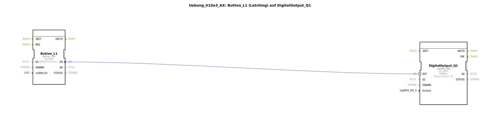

# Uebung_010a3_AX: Button_L1 (Latching) auf DigitalOutput_Q1

Dieser Artikel beschreibt die logiBUS®-Übung `Uebung_010a3_AX`.

----

## Ziel der Übung

Umgang mit rastenden Tasten (Latching Buttons).

-----

## Beschreibung und Komponenten

[cite_start]Die Subapplikation `Uebung_010a3_AX.SUB` verwendet `Button_L1`[cite: 1].

### Funktionsbausteine (FBs)

  * **`Button_L1`**: Ein Button, der im ISOBUS-Pool als "Latching" definiert ist.

-----

## Funktionsweise

Wie im Code kommentiert: *"Latching Button 'rastet ein', kein T_FF nötig!"*.
Wenn der Nutzer diesen Button drückt, wechselt er seinen Zustand (Visuell z.B. eingedrückt) und sendet dauerhaft `TRUE`. Beim nächsten Druck wechselt er auf `FALSE`. Das Speicherverhalten liegt hier also im **Terminal**, nicht in der SPS-Logik.