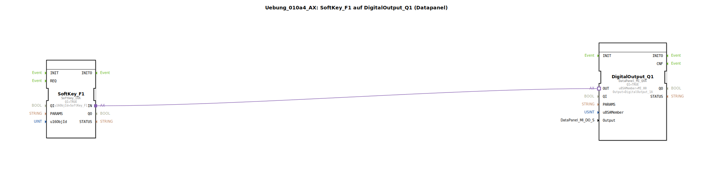

# Uebung_010a4_AX: SoftKey_F1 auf DigitalOutput_Q1 (Datapanel)

Dieser Artikel beschreibt die logiBUS®-Übung `Uebung_010a4_AX`.

## 🎧 Podcast

* [ISO 11783-6: Softkeys und das Virtual Terminal verstehen – Dein Schlüssel zur Landmaschinen-Mechatronik](https://podcasters.spotify.com/pod/show/isobus-vt-objects/episodes/ISO-11783-6-Softkeys-und-das-Virtual-Terminal-verstehen--Dein-Schlssel-zur-Landmaschinen-Mechatronik-e36a8b0)

----

## Ziel der Übung

Verknüpfung von ISOBUS (UT) und Hardware-Peripherie (DataPanel).

-----

## Beschreibung und Komponenten

[cite_start]Die Subapplikation `Uebung_010a4_AX.SUB` verbindet einen Softkey mit einem Ausgang eines DataPanels[cite: 1].

### Funktionsbausteine (FBs)

  * **`SoftKey_F1`**: Eingabe via Terminal.
  * **`DigitalOutput_Q1`**: Typ `DataPanel_MI_QXA`. Repräsentiert einen Ausgang auf einem externen CAN-Bus-Modul (DataPanel).

-----

## Funktionsweise

Dies demonstriert die Transparenz von logiBUS. Es ist für die Logik egal, ob der Ausgang direkt an der Steuerung sitzt (`logiBUS_QXA`) oder über CAN angebunden ist (`DataPanel_MI_QXA`). Der Adapter verbindet beides nahtlos.