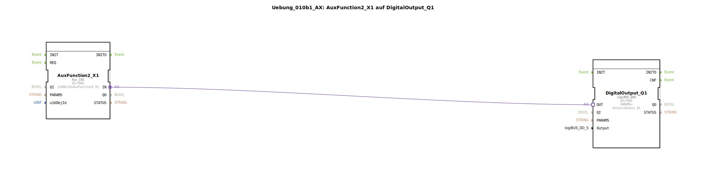

# Uebung_010b1_AX: AuxFunction2_X1 auf DigitalOutput_Q1

Dieser Artikel beschreibt die logiBUS®-Übung `Uebung_010b1_AX`. Neben Softkeys und Buttons ist AUX-N die dritte wichtige Eingabemethode im ISOBUS.

----

## Ziel der Übung

Verarbeitung von Auxiliary Inputs (z.B. Joystick-Tasten).

-----

## Beschreibung und Komponenten

[cite_start]Die Subapplikation `Uebung_010b1_AX.SUB` verbindet eine AUX-Funktion mit einem Ausgang[cite: 1].

### Funktionsbausteine (FBs)

  * **`AuxFunction2_X1`**: Typ `isobus::UT::io::Auxiliary::IN::Aux_IXA`. Dieser Baustein lauscht auf ISOBUS AUX-Nachrichten für die definierte Funktion.

-----

## Funktionsweise

Im Gegensatz zu Softkeys, die fest auf dem Bildschirm sind, ist eine AUX-Funktion abstrakt. Der Nutzer muss am Terminal erst einen physischen Eingang (z.B. Taste auf dem Joystick) dieser Funktion ("Funktion 2") zuweisen (Teaching).
Sobald das Mapping steht: Joystick-Taste drücken -> `Aux_IXA` wird TRUE -> Ausgang schaltet.