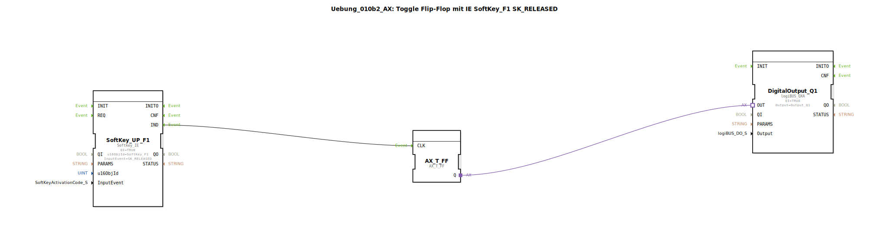

# Uebung_010b2_AX: Toggle Flip-Flop mit IE SoftKey_F1 SK_RELEASED

Dieser Artikel beschreibt die logiBUS®-Übung `Uebung_010b2_AX`.

## 🎧 Podcast

* [ISO 11783-6: Softkeys und das Virtual Terminal verstehen – Dein Schlüssel zur Landmaschinen-Mechatronik](https://podcasters.spotify.com/pod/show/isobus-vt-objects/episodes/ISO-11783-6-Softkeys-und-das-Virtual-Terminal-verstehen--Dein-Schlssel-zur-Landmaschinen-Mechatronik-e36a8b0)

----

## Ziel der Übung

Verwendung von `Softkey_IE` (Event) anstelle von `Softkey_IXA` (Zustand).

-----

## Beschreibung und Komponenten

[cite_start]Die Subapplikation `Uebung_010b2_AX.SUB` nutzt einen Softkey, um ein Flip-Flop zu toggeln[cite: 1].

### Funktionsbausteine (FBs)

  * **`SoftKey_UP_F1`**: Typ `isobus::UT::io::Softkey::Softkey_IE`.
  * **InputEvent**: `SK_RELEASED`.

-----

## Funktionsweise

Das Event wird gefeuert, wenn der Nutzer den Softkey **loslässt**. Dies ist das Standardverhalten für "Klick"-Interaktionen (ähnlich wie bei einer Maus). Das Flip-Flop wechselt bei jedem Loslassen den Zustand.