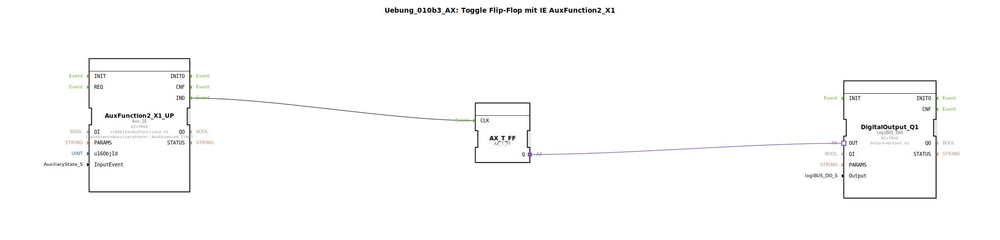

# Uebung_010b3_AX: Toggle Flip-Flop mit IE AuxFunction2_X1

Dieser Artikel beschreibt die logiBUS®-Übung `Uebung_010b3_AX`.

----

## Ziel der Übung

Verwendung von `Aux_IE` (Event).

-----

## Beschreibung und Komponenten

[cite_start]Die Subapplikation `Uebung_010b3_AX.SUB` toggelt ein Flip-Flop über AUX[cite: 1].

### Funktionsbausteine (FBs)

  * **`AuxFunction2_X1_UP`**: Typ `isobus::UT::io::Auxiliary::IN::Aux_IE`.
  * **InputEvent**: `AuxDisabled_START`.

-----

## Funktionsweise

Das Event-Namensschema bei AUX ist etwas speziell:
*   `AuxDisabled`: Bedeutet, der Schalter ist "Aus" (Offen).
*   `AuxEnabled`: Bedeutet, der Schalter ist "Ein" (Geschlossen).
*   `_START`: Bedeutet Flanke (Übergang in diesen Zustand).

`AuxDisabled_START` bedeutet also: Der Übergang von "Enabled" zu "Disabled". Das entspricht dem **Loslassen** eines Tasters (`Falling Edge`). Das Flip-Flop schaltet also beim Loslassen der Joystick-Taste um.