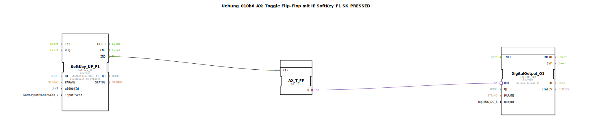

# Uebung_010b6_AX: Toggle Flip-Flop mit IE SoftKey_F1 SK_PRESSED

Dieser Artikel beschreibt die logiBUS®-Übung `Uebung_010b6_AX`.

## 🎧 Podcast

* [ISO 11783-6: Softkeys und das Virtual Terminal verstehen – Dein Schlüssel zur Landmaschinen-Mechatronik](https://podcasters.spotify.com/pod/show/isobus-vt-objects/episodes/ISO-11783-6-Softkeys-und-das-Virtual-Terminal-verstehen--Dein-Schlssel-zur-Landmaschinen-Mechatronik-e36a8b0)

----

## Ziel der Übung

Reaktion beim Drücken.

-----

## Beschreibung

[cite_start]Verwendet das Event `SK_PRESSED`[cite: 1].

-----

## Funktionsweise

Das Flip-Flop schaltet bereits im Moment des Berührens ("Touch Down") um, nicht erst beim Loslassen. Das fühlt sich "schneller" an, ist aber untypisch für Touch-Bedienoberflächen (wo man meist noch wegziehen kann, um abzubrechen).