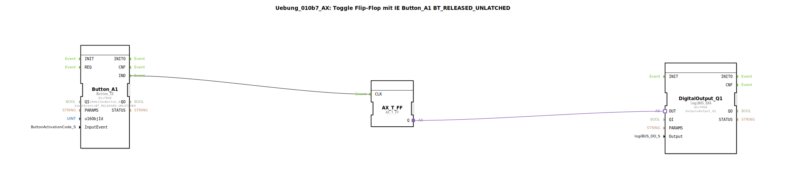

# Uebung_010b7_AX: Toggle Flip-Flop mit IE Button_A1 BT_RELEASED_UNLATCHED

Dieser Artikel beschreibt die logiBUS®-Übung `Uebung_010b7_AX`.

----

## Ziel der Übung

Events von Buttons.

-----

## Beschreibung

[cite_start]Nutzt `Button_A1` mit `BT_RELEASED_UNLATCHED`[cite: 1].

-----

## Funktionsweise

Feuert, wenn ein nicht-rastender Button losgelassen wird. Entspricht einem normalen Klick.

