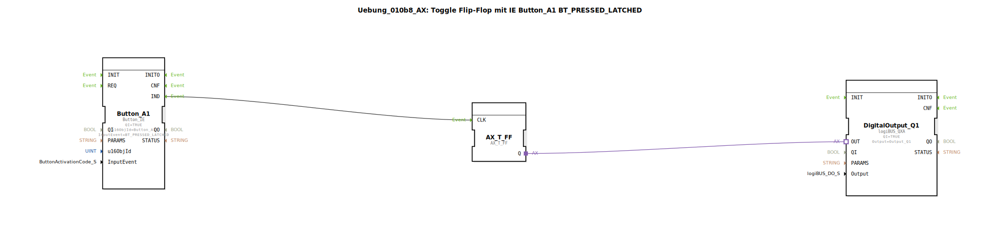

# Uebung_010b8_AX: Toggle Flip-Flop mit IE Button_A1 BT_PRESSED_LATCHED

Dieser Artikel beschreibt die logiBUS®-Übung `Uebung_010b8_AX`.

----

## Ziel der Übung

Events bei rastenden Buttons.

-----

## Beschreibung

[cite_start]Nutzt `Button_A1` mit `BT_PRESSED_LATCHED`[cite: 1].

-----

## Funktionsweise

Dies ist für Buttons gedacht, die visuell einrasten sollen. Das Event kommt, wenn der Button in den Zustand "Gedrückt/Latched" übergeht.

