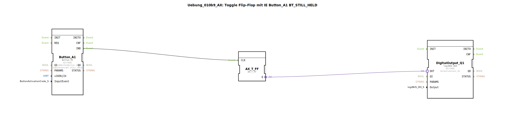

# Uebung_010b9_AX: Toggle Flip-Flop mit IE Button_A1 BT_STILL_HELD

Dieser Artikel beschreibt die logiBUS®-Übung `Uebung_010b9_AX`.

----

## Ziel der Übung

Wiederholende Events.

-----

## Beschreibung

[cite_start]Nutzt `Button_A1` mit `BT_STILL_HELD`[cite: 1].

-----

## Funktionsweise

Wie im Kommentar beschrieben: *"BT_STILL_HELD wird alle 200ms wiederholt."*
Wenn der Nutzer den Button gedrückt hält, feuert der Baustein alle 200ms ein Event. Da dies an ein Toggle-Flip-Flop geht, blinkt der Ausgang (`Q1`) alle 200ms um (Periode 400ms), solange gedrückt wird.