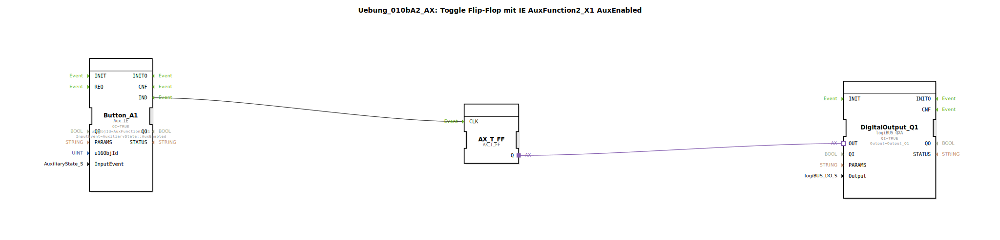

# Uebung_010bA2_AX: Toggle Flip-Flop mit IE AuxFunction2_X1 AuxEnabled

Dieser Artikel beschreibt die logiBUS®-Übung `Uebung_010bA2_AX`. Hier geht es um Feinheiten der AUX-Spezifikation.

----

## Ziel der Übung

Verhalten von `AuxEnabled`.

-----

## Beschreibung

[cite_start]Nutzt `AuxFunction2_X1` mit `AuxEnabled`[cite: 1].

-----

## Funktionsweise

Kommentar erklärt den Unterschied je nach AUX-Typ (Bool_Latched=0 vs Bool_NonLatched=2).

Bei einem **Typ 2 (NonLatched)** (z.B. Taster am Joystick) wird `AuxEnabled` **einmal** gesendet beim Drücken.
Bei einem **Typ 0 (Latched)** (z.B. Kippschalter) wird `AuxEnabled` **zyklisch wiederholt**, solange er an ist.

Da hier Typ 2 angenommen wird, verhält es sich wie ein normaler Klick.