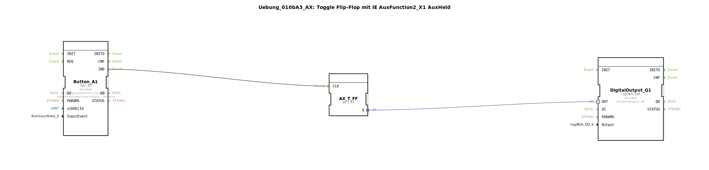

# Uebung_010bA3_AX: Toggle Flip-Flop mit IE AuxFunction2_X1 AuxHeld

Dieser Artikel beschreibt die logiBUS®-Übung `Uebung_010bA3_AX`.

----

## Ziel der Übung

Verhalten von `AuxHeld`.

-----

## Beschreibung

[cite_start]Nutzt `AuxFunction2_X1` mit `AuxHeld`[cite: 1].

-----

## Funktionsweise

Kommentar: *"AuxHeld wird wiederholt bei einem AUX Type 2. Ergibt einen Blinker."*
Ähnlich wie `BT_STILL_HELD`: Solange der Joystick-Knopf gehalten wird, kommen Events, und das Flip-Flop blinkt.