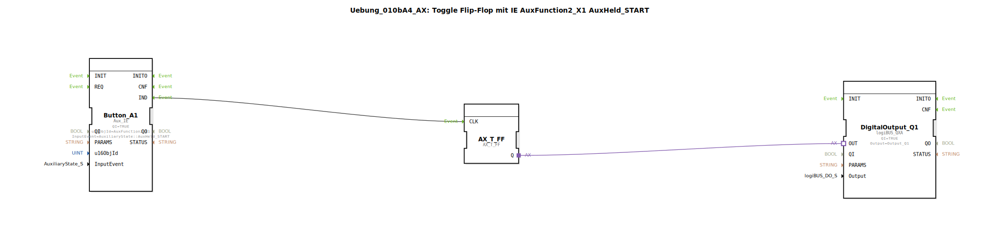

# Uebung_010bA4_AX: Toggle Flip-Flop mit IE AuxFunction2_X1 AuxHeld_START

Dieser Artikel beschreibt die logiBUS®-Übung `Uebung_010bA4_AX`.

----

## Ziel der Übung

Verhalten von `AuxHeld_START`.

-----

## Beschreibung

[cite_start]Nutzt `AuxFunction2_X1` mit `AuxHeld_START`[cite: 1].

-----

## Funktionsweise

Kommentar: *"AuxHeld_START wird nur einmal gesendet. Egal welcher Typ."*
Das ist das korrekte Event für "Long Press" bei AUX.