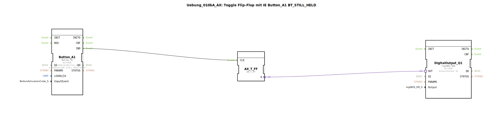

# Uebung_010bA_AX: Toggle Flip-Flop mit IE Button_A1 BT_STILL_HELD

Dieser Artikel beschreibt die logiBUS®-Übung `Uebung_010bA_AX`.

----

## Ziel der Übung

Unterschied zu `STILL_HELD`.

-----

## Beschreibung

[cite_start]Nutzt `Button_A1` mit `BT_STILL_HELD_START`[cite: 1].

-----

## Funktionsweise

Kommentar: *"BT_STILL_HELD_START wird nicht wiederholt. Lange drücken ergibt 1 Event."*
Dies entspricht einem "Long Press" Event für ISOBUS-Buttons. Es feuert genau einmal, wenn die Schwelle für "gehalten" überschritten wird.