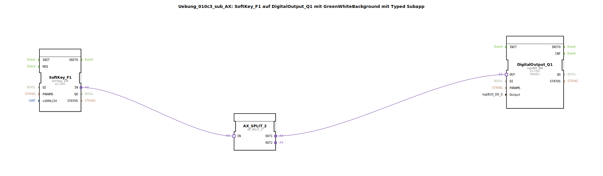

Hier ist die Dokumentation für die Übung basierend auf dem bereitgestellten XML-Inhalt.

# Uebung_010c3_sub_AX: SoftKey_F1 auf DigitalOutput_Q1 mit GreenWhiteBackground mit Typed Subapp

*(Hier Platzhalter für ein Bild der Übung einfügen)*

* * * * * * * * * *

## Einleitung
Diese Übung demonstriert die Erstellung und Nutzung einer "Typed SubApp" (typisierte Unteranwendung). Die Logik verbindet eine SoftKey-Eingabe (F1) auf einem ISOBUS-Terminal mit einem physikalischen digitalen Ausgang (Q1) sowie einer visuellen Rückmeldung (Hintergrundfarbe). Durch die Kapselung in einer SubApp wird der Code modular und wiederverwendbar gestaltet.

## Verwendete Funktionsbausteine (FBs)

In dieser SubApp werden verschiedene Funktionsbausteine und eine weitere SubApp verschaltet, um die gewünschte Funktionalität zu erreichen.

### Sub-Bausteine: Uebung_010c3_sub_AX (Diese Komponente selbst)
*   **Typ**: SubAppType
*   **Schnittstelle**:
    *   **Eingänge**:
        *   `u16ObjId` (UINT): Die Objekt-ID für das ISOBUS-Element.
        *   `Output` (logiBUS_DO_S): Identifiziert den physikalischen Ausgang (z.B. Q1..Q8).
*   **Verwendete interne FBs**:

    *   **SoftKey_F1**: `isobus::UT::io::Softkey::Softkey_IXA`
        *   **Parameter**:
            *   `QI` = `TRUE`
        *   **Ereignisausgang/-eingang**: Adapter-Verbindung über Port `IN`.
        *   **Dateneingang**: `u16ObjId` (kommt von der SubApp-Schnittstelle).
        *   **Beschreibung**: Dieser Baustein repräsentiert die SoftKey-Taste F1 auf dem Universal Terminal (UT).

    *   **DigitalOutput_Q1**: `logiBUS::io::DQ::logiBUS_QXA`
        *   **Parameter**:
            *   `QI` = `TRUE`
            *   `PARAMS` = (Visible: false)
        *   **Ereignisausgang/-eingang**: Adapter-Verbindung über Port `OUT`.
        *   **Dateneingang**: `Output` (kommt von der SubApp-Schnittstelle).
        *   **Beschreibung**: Steuert einen hardwareseitigen digitalen Ausgang über den logiBUS an.

    *   **AX_SPLIT_2**: `adapter::events::unidirectional::AX_SPLIT_2`
        *   **Funktionsweise**: Ein Splitter-Baustein für Adapter-Verbindungen. Er nimmt ein Adapter-Signal entgegen (`IN`) und teilt es auf zwei Ausgänge (`OUT1`, `OUT2`) auf, um mehrere Ziele gleichzeitig anzusteuern.

    *   **GreenWhiteBackground_AX**: `MyLib::sys::GreenWhiteBackground_AX`
        *   **Typ**: Verschachtelte SubApp
        *   **Verbindungen**:
            *   Dateneingang `u16ObjId` verbunden mit der Schnittstelle.
            *   Adaptereingang `DI1` verbunden mit `AX_SPLIT_2.OUT2`.
        *   **Beschreibung**: Eine weitere gekapselte Logik, die für die Umschaltung der Hintergrundfarbe (Grün/Weiß) zuständig ist.

## Programmablauf und Verbindungen

Der Ablauf innerhalb dieser SubApp gestaltet sich wie folgt:

1.  **Initialisierung**: Über die Eingänge der SubApp (`u16ObjId` und `Output`) werden die IDs für das ISOBUS-Objekt und der zu schaltende Hardware-Ausgang an die internen Bausteine weitergereicht.
2.  **Eingabe (SoftKey)**: Der Baustein `SoftKey_F1` überwacht die Taste F1 des Terminals. Wird diese betätigt, wird ein Signal über den Adapter-Port `IN` gesendet.
3.  **Signalverteilung**: Das Signal vom SoftKey gelangt zum Baustein `AX_SPLIT_2`. Dieser teilt das Signal auf zwei Pfade auf:
    *   **Pfad 1 (Hardware)**: Geht an `DigitalOutput_Q1`. Hierdurch wird der physikalische Ausgang (entsprechend dem Eingangsparameter `Output`) geschaltet.
    *   **Pfad 2 (Visualisierung)**: Geht an die SubApp `GreenWhiteBackground_AX`. Diese sorgt vermutlich dafür, dass sich die Hintergrundfarbe des zugehörigen Objekts ändert, um dem Benutzer eine visuelle Rückmeldung zu geben.

**Lernziele:**
*   Verständnis von Adapter-Verbindungen (Adapter Connections) und deren Splitting.
*   Umgang mit verschachtelten SubApps (SubApp in SubApp).
*   Verknüpfung von ISOBUS-UI-Elementen mit Hardware-I/Os.

**Voraussetzungen:**
*   Grundkenntnisse in IEC 61499.
*   Verständnis des Adapter-Konzepts in 4diac.

## Zusammenfassung
Die Übung `Uebung_010c3_sub_AX` ist ein wiederverwendbares Modul, das eine SoftKey-Bedienung gleichzeitig auf einen Hardware-Ausgang und eine Display-Visualisierung abbildet. Durch den Einsatz des `AX_SPLIT_2` Bausteins wird demonstriert, wie ein einzelnes Adapter-Event parallel verarbeitet werden kann, um Hardware-Aktionen und UI-Updates synchron zu halten.