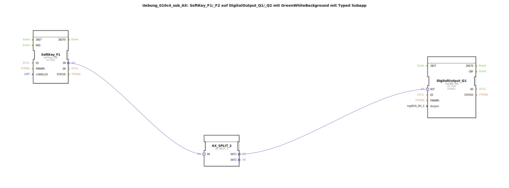

Hier ist die Dokumentation für die Übung `Uebung_010c4_sub_AX` basierend auf den bereitgestellten XML-Inhalten.

# Uebung_010c4_sub_AX: SoftKey_F1/_F2 auf DigitalOutput_Q1/_Q2 mit GreenWhiteBackground mit Typed Subapp

*(Platzhalter für ein Bild der Übung, falls vorhanden)*

* * * * * * * * * *

## Einleitung
Diese Übung behandelt die Erstellung einer typisierten Sub-Applikation (`SubAppType`). Das Ziel dieses Bausteins ist es, eine ISOBUS-Softtaste (SoftKey) mit einem digitalen Ausgang (DigitalOutput) zu verknüpfen und gleichzeitig eine visuelle Rückmeldung über eine Hintergrundsteuerung zu realisieren. Der Baustein kapselt diese Logik, um sie wiederverwendbar zu machen (z.B. für F1/Q1, F2/Q2 etc.).

## Verwendete Funktionsbausteine (FBs)

In diesem Netzwerk werden verschiedene spezialisierte Funktionsbausteine verwendet, um die Kommunikation zwischen Benutzereingabe (Softkey) und Hardwareausgabe (Digital Output) zu steuern.

### Haupt-Funktionsbausteine
Folgende Funktionsbausteine sind direkt im Netzwerk verschaltet:

*   **SoftKey_F1** (`isobus::UT::io::Softkey::Softkey_IXA`):
    *   Dient als Eingabeschnittstelle für eine Softtaste auf dem Universal Terminal (UT).
    *   Parameter `QI` ist auf `TRUE` gesetzt.
*   **DigitalOutput_Q1** (`logiBUS::io::DQ::logiBUS_QXA`):
    *   Repräsentiert den physikalischen digitalen Ausgang.
    *   Parameter `QI` ist auf `TRUE` gesetzt.
*   **AX_SPLIT_2** (`adapter::events::unidirectional::AX_SPLIT_2`):
    *   Ein Adapter-Baustein, der ein eingehendes Signal aufspaltet, um es an zwei verschiedene Ziele weiterzuleiten (Splitter).

### Sub-Bausteine: GreenWhiteBackground_AX
Innerhalb dieser Übung wird eine weitere Sub-Applikation instanziiert.

- **Typ**: `MyLib::sys::GreenWhiteBackground_AX`
- **Verwendete interne FBs**:
    *   *Hinweis: Die interne Struktur dieses Sub-Bausteins ist nicht im bereitgestellten XML enthalten. Basierend auf der Verschaltung im übergeordneten Netzwerk lässt sich folgende Schnittstellennutzung ableiten:*
    - **Ereignisausgang/-eingang**:
        - Eingang `DI1`: Verbunden mit dem Splitter-Ausgang `OUT2`.
    - **Datenausgang/-eingang**:
        - Eingang `u16ObjId`: Verbunden mit der Eingangsvariablen `u16ObjId`.
- **Funktionsweise**:
    Dieser Sub-Baustein steuert vermutlich die visuelle Darstellung (grüner/weißer Hintergrund) auf dem Terminal, basierend auf dem Status der Softtaste.

## Programmablauf und Verbindungen

Der Ablauf innerhalb der `Uebung_010c4_sub_AX` wird durch Adapter- und Datenverbindungen gesteuert:

1.  **Datenfluss (Initialisierung):**
    *   Die Objekt-ID (`u16ObjId`) wird von der Schnittstelle der Sub-Applikation an `SoftKey_F1` und `GreenWhiteBackground_AX` weitergeleitet. Dies definiert, welches GUI-Objekt angesprochen wird.
    *   Die Variable `Output` wird an `DigitalOutput_Q1` übergeben, um den korrekten physikalischen Ausgang zu adressieren.

2.  **Signalfluss (Laufzeit):**
    *   Wenn der **SoftKey_F1** betätigt wird, sendet er ein Signal über seinen Adapter-Anschluss `IN`.
    *   Dieses Signal gelangt zum Splitter-Baustein **AX_SPLIT_2**.
    *   Der Splitter teilt das Signal auf zwei Pfade auf:
        *   **Pfad 1 (`OUT1`):** Geht an `DigitalOutput_Q1.OUT`. Dies schaltet den digitalen Ausgang.
        *   **Pfad 2 (`OUT2`):** Geht an `GreenWhiteBackground_AX.DI1`. Dies löst die Änderung der Hintergrundfarbe (visuelles Feedback) aus.

Diese Struktur stellt sicher, dass Hardware-Schaltung und visuelles Feedback synchron zur Tastenbetätigung erfolgen.

## Zusammenfassung
Die `Uebung_010c4_sub_AX` ist ein modularer Baustein zur Kopplung einer Softtaste mit einem Digitalausgang und einer visuellen Rückmeldung. Durch die Verwendung von Adaptern (`AX_SPLIT_2`) wird die Signalverteilung effizient gelöst, während die Datenverbindungen die notwendige Konfiguration (IDs) bereitstellen.