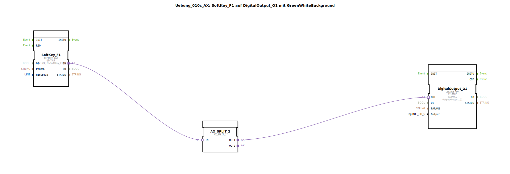

# Uebung_010c_AX: SoftKey_F1 auf DigitalOutput_Q1 mit GreenWhiteBackground

Dieser Artikel beschreibt die logiBUS®-Übung `Uebung_010c_AX`. Bisher haben die Tasten nur geschaltet. Jetzt sollen sie auch leuchten.

## 🎧 Podcast

* [ISO 11783-6: Softkeys und das Virtual Terminal verstehen – Dein Schlüssel zur Landmaschinen-Mechatronik](https://podcasters.spotify.com/pod/show/isobus-vt-objects/episodes/ISO-11783-6-Softkeys-und-das-Virtual-Terminal-verstehen--Dein-Schlssel-zur-Landmaschinen-Mechatronik-e36a8b0)

----

## Ziel der Übung

Rückmeldung an den Bediener (Farbumschlag).

-----

## Beschreibung und Komponenten

[cite_start]Die Subapplikation `Uebung_010c_AX.SUB` erweitert die einfache Softkey-Schaltung um einen Feedback-Baustein[cite: 1].

### Funktionsbausteine (FBs)

  * **`SoftKey_F1`**: Eingabe.
  * **`DigitalOutput_Q1`**: Ausgabe (Lampe).
  * **`GreenWhiteBackground_AX`**: Eine SubApp aus der Bibliothek `MyLib::sys`. Diese steuert das Aussehen des Softkeys auf dem Terminal (Grün = Aktiv, Weiß = Inaktiv).
  * **`AX_SPLIT_2`**: Verteilt das Signal vom Softkey sowohl an den Ausgang `Q1` als auch an den Feedback-Baustein.

-----

## Funktionsweise

Wenn der Nutzer drückt, wird das Signal wahr.
1.  Der physische Ausgang geht an.
2.  Parallel dazu wird der Eingang `DI1` der Feedback-SubApp `TRUE`. Diese sendet ein ISOBUS-Kommando an das Terminal, um den Hintergrund des Softkeys `F1` auf Grün zu ändern.
3.  Beim Loslassen wird der Ausgang aus und der Softkey wieder Weiß.

Dies gibt dem Nutzer direktes visuelles Feedback auf dem Touchscreen.