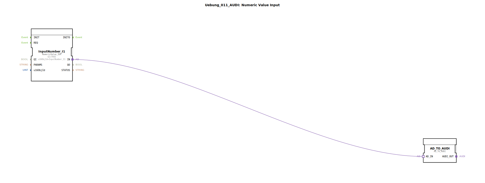

# Uebung_011_AUDI: Numeric Value Input


Dieser Artikel beschreibt die logiBUS®-Übung `Uebung_011_AUDI`. Sie ist die adapterbasierte Variante der Übung 011 und zeigt, wie numerische Werte effizient und übersichtlich verarbeitet werden.

----


## Ziel der Übung

Erlernen der modernen, adapterbasierten Verarbeitung von ISOBUS-Terminal-Eingaben. Durch die Verwendung von Adaptern wird das Baustein-Netzwerk kompakter und die Trennung von Ereignis- und Datenfluss erfolgt implizit innerhalb der Adapter-Struktur.

-----

## Beschreibung und Komponenten

Die Subapplikation `Uebung_011_AUDI.SUB` nutzt einen adapterbasierten Eingabe-Baustein.

### Funktionsbausteine (FBs)




  * **`InputNumber_I1`**: Typ `NumericValue_IDA`. Dieser Baustein stellt ein numerisches Eingabefeld auf dem ISOBUS-Terminal dar. Im Gegensatz zur Standard-Variante (`_ID`) nutzt dieser Baustein einen AX-basierten Adapter-Ausgang (`IN`), der sowohl das Ereignis als auch den DWORD-Wert bündelt.
  * **`F_DWORD_TO_UDINT`**: Hier wird der neue Bausteintyp `AD_TO_AUDI` verwendet. Er nimmt den `AD`-Adapter entgegen und gibt einen `AUDI`-Adapter aus, der den Wert als `UDINT` führt.

-----

## Funktionsweise

Die Verbindung zwischen Eingabe und Konvertierung erfolgt ausschließlich über eine Adapter-Linie:

```xml
<AdapterConnections>
    <Connection Source="InputNumber_I1.IN" Destination="F_DWORD_TO_UDINT.AD_IN"/>
</AdapterConnections>
```

1.  Der Nutzer gibt am Terminal einen Wert ein (z. B. "100").
2.  Nach der Bestätigung sendet der Baustein `InputNumber_I1` das Update über den Adapter-Plug.
3.  Der Konverter `AD_TO_AUDI` (instanziiert als `F_DWORD_TO_UDINT`) empfängt dieses Paket, wandelt den Typ und stellt das Ergebnis am `AUDI`-Plug für die restliche Logik bereit.

-----

## Fazit

Die Übung verdeutlicht den Vorteil von Adaptern: Anstatt separate Linien für Ereignisse (`REQ`/`CNF`) und Daten (`IN`/`OUT`) ziehen zu müssen, reicht eine einzige Adapter-Verbindung aus. Dies reduziert die Fehleranfälligkeit und erhöht die Lesbarkeit des Programms erheblich.