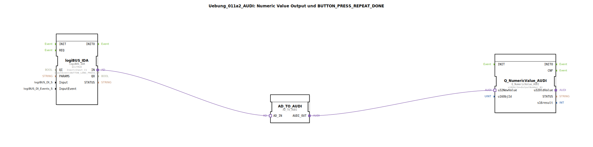

# Uebung_011a2_AUDI: Numeric Value Output und BUTTON_PRESS_REPEAT_DONE

* * * * * * * * * *
## Einleitung
Diese Übung demonstriert die Ausgabe eines numerischen Werts unter Verwendung eines Tastendruck-Ereignisses (BUTTON_LONG_PRESS_UP). Dabei wird ein digitaler Eingangsbaustein (logiBUS_IDA) verwendet, der bei einem langen Tastendruck ein Ereignis auslöst. Dieses Ereignis wird über einen Adapter in ein Format konvertiert, das der Ausgabebaustein Q_NumericValue_AUDI verarbeiten kann – dieser gibt dann den vordefinierten numerischen Wert auf dem ISOBUS aus.

## Verwendete Funktionsbausteine (FBs)
- **logiBUS_IDA**  
  - **Typ**: logiBUS::io::DI::logiBUS_IDA  
  - **Parameter**: QI = TRUE, Input = Input_I1, InputEvent = BUTTON_LONG_PRESS_UP  
  - **Funktionsweise**: Stellt einen digitalen Eingang dar, der auf das Ereignis „langer Tastendruck“ (Long Press Up) reagiert. Bei Auslösung wird ein entsprechendes Signal an den Adapter weitergegeben.

- **AD_TO_AUDI**  
  - **Typ**: adapter::conversion::unidirectional::AD_TO_AUDI  
  - **Funktionsweise**: Dient als Adapter zur unidirektionalen Konvertierung von logiBUS-ADA-Daten in das Format, das der numerische Ausgabebaustein (Q_NumericValue_AUDI) erwartet. Er wandelt das Ereignis in einen Datenwert um.

- **Q_NumericValue_AUDI**  
  - **Typ**: isobus::UT::Q::Q_NumericValue_AUDI  
  - **Parameter**: u16ObjId = OutputNumber_N1  
  - **Funktionsweise**: Nimmt einen 32‑Bit‑Wert (hier über den Adapter) entgegen und gibt ihn über das ISOBUS‑Objekt mit der Objekt-ID `OutputNumber_N1` aus. Dies ermöglicht die Anzeige eines numerischen Werts auf einem ISOBUS‑Terminal.

## Programmablauf und Verbindungen
Die Funktionsbausteine sind wie folgt miteinander verbunden:

1. **logiBUS_IDA** -> **AD_TO_AUDI (AD_IN)**:  
   Bei einem langen Tastendruck (Ereignis `BUTTON_LONG_PRESS_UP`) erzeugt `logiBUS_IDA` ein Signal auf dem Ausgang `IN`, das an den Adaptereingang `AD_IN` weitergeleitet wird.

2. **AD_TO_AUDI (AUDI_OUT)** -> **Q_NumericValue_AUDI (u32NewValue)**:  
   Der Adapter wandelt das eingehende Signal in einen numerischen Datenwert um und sendet ihn über den Ausgang `AUDI_OUT` an den Dateneingang `u32NewValue` des Ausgabebausteins.

Durch diese Kette wird bei jedem langen Tastendruck der festgelegte numerische Wert (hier das ISOBUS-Objekt `OutputNumber_N1`) ausgegeben.

**Lernziele**:  
- Verwendung von digitalen Eingangsbausteinen mit Ereignisauslösung (Long Press).  
- Einsatz von Adaptern zur Konvertierung zwischen verschiedenen Protokoll‑/Datenformaten.  
- Ausgabe numerischer Werte über ISOBUS‑Objekte.  

**Schwierigkeitsgrad**: Einsteiger / Grundlagen  
**Benötigte Vorkenntnisse**: Grundlegendes Verständnis von Funktionsbausteinen, Ereignissen und ISOBUS-Kommunikation.

## Zusammenfassung
Die Übung **Uebung_011a2_AUDI** zeigt einen kompakten Ablauf: Ein digitaler Tastendruck (lang) löst eine Ereigniskette aus, an deren Ende ein numerischer Wert auf dem ISOBUS ausgegeben wird. Die drei verwendeten Bausteine – der Eingangsbaustein, ein Konvertierungsadapter und der Ausgabebaustein – sind über Adapterverbindungen lose gekoppelt. Dies ermöglicht eine flexible, ereignisgesteuerte Werteausgabe und vermittelt grundlegende Konzepte der modularen Steuerungsprogrammierung.