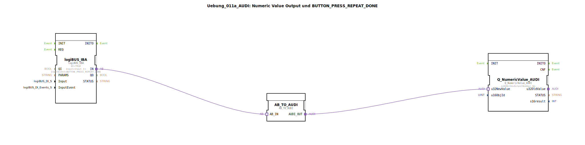

# Uebung_011a_AUDI: Numeric Value Output und BUTTON_PRESS_REPEAT_DONE




* * * * * * * * * *

## Einleitung

Diese Übung demonstriert die Verwendung eines digitalen Eingangs (Taster) mit Wiederholerkennung (`BUTTON_PRESS_REPEAT_DONE`) zur Ausgabe eines numerischen Werts auf einem ISOBUS Virtual Terminal.  
Der eingehende Tastendruck wird über eine logiBUS-IBA-Schnittstelle erfasst, über einen Adapter in ein ISOBUS-kompatibles Format umgewandelt und schließlich an einen `Q_NumericValue_AUDI`-Baustein gesendet, der den Wert auf dem Display des Terminals darstellt.

Die Übung basiert auf dem Standard IEC 61499 und nutzt die vordefinierten Bibliotheken `logiBUS` und `isobus`. Sie eignet sich für Einsteiger in die 4diac-IDE, die sich mit der Verknüpfung von physikalischen Eingängen und ISOBUS-VT-Komponenten vertraut machen möchten.

## Verwendete Funktionsbausteine (FBs)

Im SubApp `Uebung_011a_AUDI` kommen drei Funktionsbausteine zum Einsatz:

- **logiBUS_IBA**  
  - **Typ**: `logiBUS::io::DI::logiBUS_IBA`  
  - **Parameter**:  
    - `QI` = `TRUE` (Initialisierung aktiv)  
    - `Input` = `Input_I1` (physikalischer Digitaleingang)  
    - `InputEvent` = `BUTTON_PRESS_REPEAT_DONE` (Ereignis bei Tastendruck mit Wiederholung)  
  - **Funktion**: Dieser Baustein liest einen digitalen Eingang (Taster) aus. Das Ereignis `BUTTON_PRESS_REPEAT_DONE` wird ausgelöst, sobald der Taster gedrückt wird – inklusive Wiederholfunktion (z. B. für langes Drücken). Der gelesene Wert wird über den Adapterausgang `IN` als AB-Format (Arbeitsblatt) bereitgestellt.

- **AB_TO_AUDI**  
  - **Typ**: `adapter::conversion::unidirectional::AB_TO_AUDI`  
  - **Parameter**: keine (reine Konvertierung)  
  - **Funktion**: Dieser Adapter wandelt das AB-Format (interne Darstellung der logiBUS-Eingänge) in das AUDI-Format um, das von den `isobus`-Bausteinen verarbeitet werden kann. Die Umwandlung erfolgt unidirektional.

- **Q_NumericValue_AUDI**  
  - **Typ**: `isobus::UT::Q::Q_NumericValue_AUDI`  
  - **Parameter**:  
    - `u16ObjId` = `OutputNumber_N1` (ID des numerischen Ausgabeobjekts auf dem Virtual Terminal)  
  - **Funktion**: Dieser Baustein empfängt einen numerischen Wert im AUDI-Format (über `u32NewValue`) und sendet diesen an das auf dem ISOBUS-VT definierte Objekt mit der ID `OutputNumber_N1`. Der Wert wird dort sichtbar dargestellt.

> **Hinweis**: Die Übung enthält keine eigenen Sub-Bausteine (SubAppTypes). Die genannten FBs stammen aus den importierten Bibliotheken `logiBUS` und `isobus`.

## Programmablauf und Verbindungen

1. **Ereignisauslösung**  
   Ein Druck auf den Taster (definiert als `Input_I1`) mit Wiederholerkennung erzeugt das Ereignis `BUTTON_PRESS_REPEAT_DONE`. Dieses Ereignis aktiviert den Baustein `logiBUS_IBA`.

2. **Einlesen des Eingangs**  
   `logiBUS_IBA` liest den aktuellen Zustand des Digitaleingangs und stellt ihn über den Adapterausgang `IN` als AB-Format bereit.

3. **Formatkonvertierung**  
   Der Adapter `AB_TO_AUDI` wandelt das AB-Format in das AUDI-Format um. Die Verbindung erfolgt über eine Adapterverbindung (`AdapterConnections`):
   - `Source="logiBUS_IBA.IN"` → `Destination="AB_TO_AUDI.AB_IN"`

4. **Ausgabe auf dem Virtual Terminal**  
   Der konvertierte Wert (AUDI-Format) wird am Ausgang `AUDI_OUT` von `AB_TO_AUDI` bereitgestellt und über eine weitere Adapterverbindung an den Baustein `Q_NumericValue_AUDI` übergeben:
   - `Source="AB_TO_AUDI.AUDI_OUT"` → `Destination="Q_NumericValue_AUDI.u32NewValue"`

   `Q_NumericValue_AUDI` aktualisiert daraufhin das auf dem ISOBUS-VT hinterlegte numerische Objekt mit der ID `OutputNumber_N1`.

**Zusammenfassender Datenfluss**:

```
Taster (Input_I1) -> BUTTON_PRESS_REPEAT_DONE -> logiBUS_IBA -> AB_TO_AUDI -> Q_NumericValue_AUDI -> VT-Objekt OutputNumber_N1
```

Die gesamte Logik ist in einem SubApp `Uebung_011a_AUDI` gekapselt, der keinerlei eigene Ein-/Ausgangsschnittstellen besitzt (leeres `SubAppInterfaceList`). Die Verbindungen nach außen erfolgen ausschließlich über die verwendeten Bausteine, deren Parameter auf globale Konstanten (`Input_I1`, `OutputNumber_N1`, `BUTTON_PRESS_REPEAT_DONE`) verweisen.

## Zusammenfassung

In dieser Übung wird die grundlegende Interaktion zwischen physikalischen Tastern und einem ISOBUS Virtual Terminal realisiert. Die Teilnehmer lernen:

- Wie ein digitaler Eingang mit Wiederholerkennung (`BUTTON_PRESS_REPEAT_DONE`) in 4diac konfiguriert wird.
- Wie Adapter zur Formatkonvertierung (AB ↔ AUDI) eingesetzt werden.
- Wie ein numerischer Wert über `Q_NumericValue_AUDI` auf dem ISOBUS-VT ausgegeben wird.

Die Übung eignet sich als Einstieg in die ISOBUS-Kommunikation mit der 4diac-IDE. Vorausgesetzt werden grundlegende Kenntnisse der IEC 61499 sowie die Installation der Bibliotheken `logiBUS` und `isobus`. Der SubApp kann direkt in ein Anwendungsprojekt eingebunden und getestet werden.