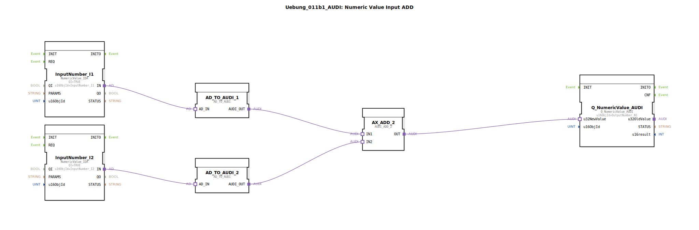

# Uebung_011b1_AUDI: Numeric Value Input ADD

* * * * * * * * * *
## Einleitung

Diese Übung demonstriert die Verarbeitung von zwei numerischen ISOBUS-Eingangswerten und deren Addition mithilfe spezieller Adapterbausteine. Die beiden eingehenden Werte (ganze Zahlen) werden über einen `AD_TO_AUDI`-Adapter in einen „AUDI“‑kompatiblen Typ konvertiert, anschließend in einem Additionsbaustein (`AUDI_ADD_2`) aufsummiert und das Ergebnis über einen Ausgabebaustein (`Q_NumericValue_AUDI`) als ISOBUS-Ausgangsobjekt bereitgestellt.

Der Fokus liegt auf dem Umgang mit Adapterverbindungen und der Typkonvertierung zwischen unterschiedlichen Datenformaten in 4diac.

## Verwendete Funktionsbausteine (FBs)

Die SubApp `Uebung_011b1_AUDI` enthält sechs Funktionsbausteine, die über Adapter verbunden sind.

### Sub-Bausteine: `InputNumber_I1` und `InputNumber_I2`

- **Typ**: `isobus::UT::io::NumericValue::NumericValue_IDA`
- **Parameter**:
    - `QI` = `TRUE`
    - `u16ObjId` = `InputNumber_I1` bzw. `InputNumber_I2`
- **Funktionsweise**:  
  Diese Bausteine stellen den Zugriff auf zwei ISOBUS‑NumericValue‑Eingangsobjekte dar. Sie liefern an ihrem Ausgangsadapter `IN` einen numerischen Wert (ganze Zahl) vom ISOBUS‑Datentyp. Der Parameter `u16ObjId` definiert die Kennung des jeweiligen Eingangsobjekts.

### Sub-Bausteine: `AD_TO_AUDI_1` und `AD_TO_AUDI_2`

- **Typ**: `adapter::conversion::unidirectional::AD_TO_AUDI`
- **Parameter**: keine
- **Funktionsweise**:  
  Diese Bausteine konvertieren einen Eingangswert vom Adaptertyp `AD` (der von den vorherigen NumericValue‑Bausteinen bereitgestellt wird) in den Adaptertyp `AUDI`. Die Umwandlung erfolgt unidirektional und dient der Anpassung an den nachfolgenden Additionsbaustein, der nur den `AUDI`‑Typ akzeptiert.

### Sub-Baustein: `AX_ADD_2`

- **Typ**: `adapter::iec61131::arithmetic::AUDI_ADD_2`
- **Parameter**: keine
- **Funktionsweise**:  
  Dieser Baustein führt eine Addition zweier `AUDI`‑Eingangswerte durch. Die Eingänge `IN1` und `IN2` werden über Adapterverbindungen mit den konvertierten Werten versorgt. Der Ausgang `OUT` liefert das Ergebnis als `AUDI`‑Summe.

### Sub-Baustein: `Q_NumericValue_AUDI`

- **Typ**: `isobus::UT::Q::Q_NumericValue_AUDI`
- **Parameter**:
    - `u16ObjId` = `OutputNumber_N1`
- **Funktionsweise**:  
  Dieser Baustein nimmt über den Adaptereingang `u32NewValue` den berechneten Summenwert (als `AUDI`‑Typ) entgegen und schreibt ihn als ISOBUS‑Ausgangsobjekt mit der Kennung `OutputNumber_N1`. Er fungiert somit als Ausgabe‑Schnittstelle zur angeschlossenen ISOBUS‑Steuerung.

## Programmablauf und Verbindungen

1. Die beiden ISOBUS‑Eingänge `InputNumber_I1` und `InputNumber_I2` liefern über ihre `IN`‑Adapterausgänge numerische Werte.
2. Jeweils ein `AD_TO_AUDI`-Baustein (`AD_TO_AUDI_1` und `AD_TO_AUDI_2`) konvertiert diese Werte in den `AUDI`‑Adaptertyp.
3. Die konvertierten Werte werden an die Eingänge `IN1` und `IN2` des Additionsbausteins `AX_ADD_2` übergeben.
4. `AX_ADD_2` berechnet die Summe und stellt sie an `OUT` bereit.
5. Der Summenwert gelangt an den `u32NewValue`-Eingang des Ausgabebausteins `Q_NumericValue_AUDI`, der ihn schließlich als ISOBUS‑Ausgangsobjekt `OutputNumber_N1` ausgibt.

Die gesamte Datenverarbeitung erfolgt in einem Zyklus ohne zusätzliche Ereignissteuerung – die Bausteine werden automatisch durchlaufen, sobald die Eingangswerte anliegen.

## Zusammenfassung

Die Übung zeigt eine vollständige Verarbeitungskette für zwei numerische ISOBUS‑Eingangswerte:  
- Einlesen über standardisierte ISOBUS‑Bausteine (`NumericValue_IDA`),  
- Typkonvertierung mittels Adapter‑Bausteinen (`AD_TO_AUDI`),  
- arithmetische Addition (`AUDI_ADD_2`),  
- und Ausgabe über einen ISOBUS‑Ausgangsbaustein (`Q_NumericValue_AUDI`).

Sie vermittelt grundlegende Kenntnisse im Umgang mit Adapterschnittstellen und der Datenflussprogrammierung in 4diac für industrielle ISOBUS‑Anwendungen (z. B. Landmaschinensteuerungen).