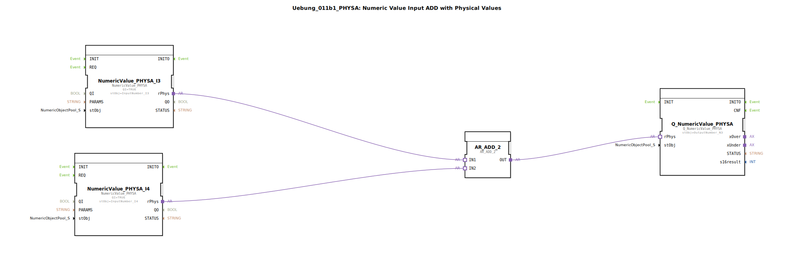

# Uebung_011b1_PHYSA: Numeric Value Input ADD with Physical Values

* * * * * * * * * *
## Einleitung

Diese Übung demonstriert die Verarbeitung von physikalischen Messwerten (z.B. Spannung, Strom, Drehzahl) durch eine arithmetische Operation. Zwei Eingangswerte aus definierten physikalischen Quellen werden mittels eines Additionsbausteins verknüpft und das Ergebnis an einen physikalischen Ausgang weitergegeben. Der Fokus liegt auf der korrekten Verdrahtung der Adapter-Schnittstellen zwischen den Funktionsbausteinen (FBs) zur Signalkopplung mit realen I/O-Kanälen.

## Verwendete Funktionsbausteine (FBs)

Die Übung besteht aus vier direkt instanziierten Funktionsbausteinen. Es sind keine weiteren Sub-Bausteine (SubApp) enthalten.

| Name | Typ | Beschreibung |
|------|-----|--------------|
| `NumericValue_PHYSA_I3` | `isobus::UT::io::NumericValue::NumericValue_PHYSA` | Liest den physikalischen Wert von der Hardwareschnittstelle `InputNumber_I3` und stellt ihn als physikalische Größe (rPhys) bereit. |
| `NumericValue_PHYSA_I4` | `isobus::UT::io::NumericValue::NumericValue_PHYSA` | Gleiche Funktion wie oben, jedoch für die Schnittstelle `InputNumber_I4`. |
| `AR_ADD_2` | `adapter::iec61131::arithmetic::AR_ADD_2` | Führt eine Addition zweier physikalischer Werte durch (IN1 + IN2) und gibt das Ergebnis als OUT aus. |
| `Q_NumericValue_PHYSA` | `isobus::UT::Q::Q_NumericValue_PHYSA` | Schreibt den übergebenen physikalischen Wert auf die Hardwareschnittstelle `OutputNumber_N3`. |

### Parameter der einzelnen Instanzen

**NumericValue_PHYSA_I3**
- `QI` = TRUE (Aktivierung)
- `stObj` = `InputNumber_I3` (Objektname der Hardwareschnittstelle)

**NumericValue_PHYSA_I4**
- `QI` = TRUE
- `stObj` = `InputNumber_I4`

**Q_NumericValue_PHYSA**
- `stObj` = `OutputNumber_N3` (Objektname der Ausgangsschnittstelle)

**AR_ADD_2** – keine Parameter gesetzt, alle Werte werden über Adapterverbindungen übergeben.

## Programmablauf und Verbindungen

Das Netzwerk verbindet die Bausteine ausschließlich über Adapter-Kanäle (Typ `AdapterConnections`). Der Datenfluss ist linear:

1. **Eingangsmanagement**:  
   Die Funktionsbausteine `NumericValue_PHYSA_I3` und `NumericValue_PHYSA_I4` lesen kontinuierlich die physikalischen Istwerte ihrer jeweiligen Hardware‑Kanäle (`InputNumber_I3`, `InputNumber_I4`) und stellen diese an ihrem Adapter‑Ausgang `rPhys` bereit.

2. **Arithmetische Verknüpfung**:  
   Der Baustein `AR_ADD_2` empfängt die beiden physikalischen Werte über die Adaptereingänge `IN1` (von `NumericValue_PHYSA_I3.rPhys`) und `IN2` (von `NumericValue_PHYSA_I4.rPhys`) und addiert sie. Das Ergebnis wird am Adapter‑Ausgang `OUT` ausgegeben.

3. **Ausgabe**:  
   Der Adapter-Ausgang `AR_ADD_2.OUT` ist mit dem Adapter-Eingang `Q_NumericValue_PHYSA.rPhys` verbunden. Der Ausgangsbaustein übernimmt diesen Wert und schreibt ihn auf die Hardware‑Schnittstelle `OutputNumber_N3`.

Die Verbindungen im Detail:
- `NumericValue_PHYSA_I3.rPhys` → `AR_ADD_2.IN1`
- `NumericValue_PHYSA_I4.rPhys` → `AR_ADD_2.IN2`
- `AR_ADD_2.OUT` → `Q_NumericValue_PHYSA.rPhys`

## Zusammenfassung

Die Übung **Uebung_011b1_PHYSA** veranschaulicht den Aufbau einer typischen Messwertverarbeitungskette in der 4diac‑IDE unter Einbeziehung physikalischer I/O‑Kanäle. Sie zeigt, wie zwei analoge Eingangswerte (z.B. Spannungen) aus unterschiedlichen Kanälen eingelesen, addiert und auf einen analogen Ausgang geschrieben werden. Die komplette Signalverkettung erfolgt ausschließlich über Adapterverbindungen – ein wesentliches Konzept für modulare und hardwareunabhängige Automatisierungslösungen.

***Lernziele***:  
- Verständnis der Adapter‑Schnittstellen `rPhys` und `stObj`  
- Zusammenspiel von Eingabe‑, Rechen‑ und Ausgabebausteinen über Adapterverbindungen  
- Umgang mit parametrierbaren I/O‑Objekten (`InputNumber_I3`, `OutputNumber_N3`)  
- Grundlagen der physikalischen Wertverarbeitung im 4diac‑Umfeld