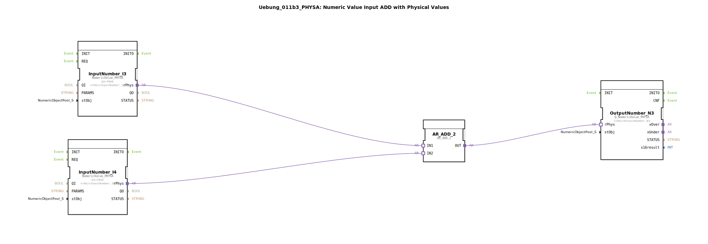

# Uebung_011b3_PHYSA: Numeric Value Input ADD with Physical Values

* * * * * * * * * *
## Einleitung
Diese Übung demonstriert die Verwendung von physikalischen Werten (Physical Values) in einer einfachen Additionsschaltung. Zwei numerische Eingänge liefern physikalische Größen, die mittels eines Additionsbausteins verrechnet werden. Das Ergebnis wird als physikalischer Wert ausgegeben. Ziel ist es, den Umgang mit Adapterverbindungen zwischen **NumericValue_PHYSA**-Bausteinen und dem standardisierten **AR_ADD_2**-Baustein zu erlernen.

## Verwendete Funktionsbausteine (FBs)

| Bausteinname | Typ | Kurzbeschreibung |
|--------------|-----|------------------|
| **InputNumber_I3** | `isobus::UT::io::NumericValue::NumericValue_PHYSA` | Physikalische Werteingabe (z. B. mit Einheit). Parameter: `QI` = TRUE, `stObj` = "InputNumber_I3". Stellt den eingegebenen physikalischen Wert über den Adapterausgang `rPhys` bereit. |
| **InputNumber_I4** | `isobus::UT::io::NumericValue::NumericValue_PHYSA` | Gleicher Typ wie InputNumber_I3. Parameter: `QI` = TRUE, `stObj` = "InputNumber_I4". |
| **AR_ADD_2** | `adapter::iec61131::arithmetic::AR_ADD_2` | Addierer aus der IEC-61131-Arithmetikbibliothek. Nimmt zwei physikalische Werte an den Adaptereingängen `IN1` und `IN2` entgegen und liefert die Summe am Adapterausgang `OUT`. |
| **OutputNumber_N3** | `isobus::UT::Q::Q_NumericValue_PHYSA` | Physikalische Wertausgabe. Nimmt einen physikalischen Wert über den Adaptereingang `rPhys` entgegen und stellt ihn als Ausgabewert zur Verfügung. Parameter: `stObj` = "OutputNumber_N3". |

*Hinweis: Es werden keine Sub-Bausteine (SubAppTypes) innerhalb dieser Übung verwendet.*

## Programmablauf und Verbindungen

Der Ablauf ist vollständig über Adapterverbindungen realisiert:

1. **Werte erfassen** – Die beiden Eingabebausteine `InputNumber_I3` und `InputNumber_I4` liefern ihre physikalischen Werte über die Adapterausgänge `rPhys`.
2. **Addition** – Diese Ausgänge werden mit den Adaptereingängen `IN1` bzw. `IN2` des Addierers `AR_ADD_2` verbunden. Der Addierer berechnet die Summe und gibt das Ergebnis an seinem Adapterausgang `OUT` aus.
3. **Wert ausgeben** – Der Ausgang `OUT` von `AR_ADD_2` ist mit dem Adaptereingang `rPhys` des Ausgabebausteins `OutputNumber_N3` verbunden. Dieser stellt das Ergebnis als physikalischen Wert dar.

Die Verbindungen sind:
- `InputNumber_I3.rPhys` → `AR_ADD_2.IN1`
- `InputNumber_I4.rPhys` → `AR_ADD_2.IN2`
- `AR_ADD_2.OUT` → `OutputNumber_N3.rPhys`

Die Übung setzt keine speziellen Vorkenntnisse voraus. Sie kann direkt in der 4diac-IDE durch Erstellen einer neuen Anwendung mit diesem SubApp-Typ und Hinzufügen entsprechender Eingabe-/Ausgabegeräte (z. B. virtuelle Slider oder physische IOs) ausgeführt werden.

## Zusammenfassung
Die SubApp **Uebung_011b3_PHYSA** realisiert eine einfache Addition zweier physikalischer Eingangswerte. Sie zeigt den typischen Aufbau einer Verarbeitungskette mit physikalischen Größen: Eingabe → Rechenoperation → Ausgabe. Dabei kommen ausschließlich Adapterverbindungen zum Einsatz, was eine flexible Kopplung der Bausteine ermöglicht. Dies ist die Grundlage für komplexere SPS-Programme mit Einheiten und physikalischen Messwerten in der 4diac-IDE.