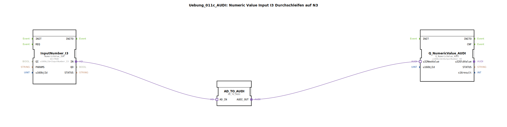

# Uebung_011c_AUDI: Numeric Value Input I3 Durchschleifen auf N3

* * * * * * * * * *
## Einleitung

Diese Übung demonstriert das Durchschleifen eines numerischen Werts von einem Eingangsbaustein (`InputNumber_I3`) auf einen Ausgangsbaustein (`Q_NumericValue_AUDI`) unter Verwendung eines Adapterbausteins (`AD_TO_AUDI`). Der Wert wird dabei unverändert übertragen („Durchschleifen“). Die SubApplikation ist als wiederverwendbare Komponente für ISOBUS‑Anwendungen konzipiert.

## Verwendete Funktionsbausteine (FBs)

- **InputNumber_I3**  
  - **Typ**: `isobus::UT::io::NumericValue::NumericValue_IDA`  
  - **Parameter**:  
    - `QI` = `TRUE`  
    - `u16ObjId` = `InputNumber_I3`  
  - **Funktion**: Stellt einen numerischen Eingangswert (z. B. von einem Bedienelement) über einen Adapterausgang (`IN`) bereit.

- **AD_TO_AUDI**  
  - **Typ**: `adapter::conversion::unidirectional::AD_TO_AUDI`  
  - **Parameter**: Keine  
  - **Funktion**: Wandelt das Adaptersignal des Eingangs (`AD_IN`) in ein für den Ausgangsbaustein passendes Signal (`AUDI_OUT`). In dieser Übung wird der Wert unverändert durchgereicht.

- **Q_NumericValue_AUDI**  
  - **Typ**: `isobus::UT::Q::Q_NumericValue_AUDI`  
  - **Parameter**:  
    - `u16ObjId` = `OutputNumber_N3`  
  - **Funktion**: Nimmt den numerischen Wert über den Dateneingang `u32NewValue` entgegen und stellt ihn als ISOBUS‑Ausgangsobjekt (z. B. zur Anzeige) zur Verfügung.

## Programmablauf und Verbindungen

1. Der Eingangsbaustein `InputNumber_I3` liefert den aktuellen numerischen Wert an seinem Adapterausgang `IN`.
2. Dieser Wert wird über eine Adapterverbindung an den Eingang `AD_IN` des Bausteins `AD_TO_AUDI` weitergeleitet.
3. Der Adapter `AD_TO_AUDI` reicht den empfangenen Wert unverändert an seinen Ausgang `AUDI_OUT` weiter.
4. Der Wert gelangt über die zweite Adapterverbindung an den Dateneingang `u32NewValue` des Ausgangsbausteins `Q_NumericValue_AUDI`.
5. Der Ausgangsbaustein stellt den Wert anschließend als ISOBUS‑Ausgangsobjekt `OutputNumber_N3` bereit.

Die gesamte Datenübertragung erfolgt ereignisgesteuert – sobald sich der Eingangswert ändert, wird die Kette automatisch durchlaufen.

## Zusammenfassung

Die Übung zeigt das grundlegende Prinzip des Datenaustauschs zwischen ISOBUS‑Ein‑ und Ausgangsbausteinen mithilfe eines Adapters. Sie vermittelt den Aufbau einer einfachen Durchschleif‑Logik und bereitet auf komplexere Verarbeitungsschritte in späteren Übungen vor. Der Schwerpunkt liegt auf dem Verständnis von Adapterverbindungen und der Parametrierung der NumericValue‑Bausteine.