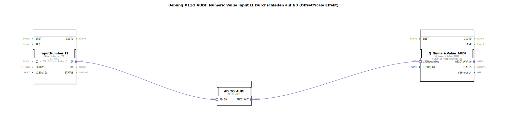

# Uebung_011d_AUDI: Numeric Value Input I1 Durchschleifen auf N3 (Offset/Scale Effekt)

* * * * * * * * * *
## Einleitung

Diese Übung demonstriert das Durchschleifen eines numerischen Eingangswerts (I1) auf einen Ausgang (N3) unter Verwendung eines Offset-/Scale-Effekts. Der eingehende Wert wird über einen Adapter gewandelt und an einen Ausgangs-Funktionsbaustein weitergegeben.  
Beispiel:  
- Eingabe von 100000 auf I1 → N3 zeigt 0,00  
- Eingabe von 50000 auf I1 → N3 zeigt -500,00  

## Verwendete Funktionsbausteine (FBs)

- **InputNumber_I1**  
  - **Typ**: `isobus::UT::io::NumericValue::NumericValue_IDA`  
  - **Parameter**:  
    - `QI` = TRUE  
    - `u16ObjId` = InputNumber_I1  
  - **Funktion**: Liest den numerischen Wert des ISOBUS-Objekts „InputNumber_I1“ und stellt ihn über den Adapterausgang `IN` bereit.

- **AD_TO_AUDI**  
  - **Typ**: `adapter::conversion::unidirectional::AD_TO_AUDI`  
  - **Parameter**: keine expliziten Parameter  
  - **Funktion**: Wandelt den ankommenden Adapterwert (AD) in einen AUDI-kompatiblen Wert um. Dabei wird der Eingangswert mit einem internen Offset und Skalierungsfaktor verarbeitet, um den gewünschten Effekt zu erzielen.

- **Q_NumericValue_AUDI**  
  - **Typ**: `isobus::UT::Q::Q_NumericValue_AUDI`  
  - **Parameter**:  
    - `u16ObjId` = OutputNumber_N3  
  - **Funktion**: Empfängt den konvertierten Wert über den Datenport `u32NewValue` und schreibt ihn auf das ISOBUS-Ausgangsobjekt „OutputNumber_N3“.

## Programmablauf und Verbindungen

1. Der Funktionsbaustein `InputNumber_I1` erfasst den aktuellen Wert des ISOBUS-Eingangsobjekts.  
2. Über die **Adapterverbindung** wird der Wert von `InputNumber_I1.IN` an `AD_TO_AUDI.AD_IN` weitergeleitet.  
3. Im Baustein `AD_TO_AUDI` erfolgt die Umrechnung (Offset/Skalierung) des Wertes.  
4. Der berechnete AUDI-Wert verlässt den Baustein über den Ausgang `AUDI_OUT` und wird an den Dateneingang `u32NewValue` von `Q_NumericValue_AUDI` geführt.  
5. `Q_NumericValue_AUDI` schreibt den finalen Wert in das Ausgangsobjekt „OutputNumber_N3“.  

Die gesamte Logik ist als Subapplikation realisiert und verwendet keine weiteren Unterbausteine. Der Ablauf ist rein datengetrieben – sobald sich der Eingangswert ändert, wird die gesamte Kette durchlaufen.

## Zusammenfassung

Die Übung „Uebung_011d_AUDI“ veranschaulicht, wie ein numerischer ISOBUS-Eingangswert über einen Adapterbaustein mit Offset/Skalierung in einen Ausgangswert umgesetzt wird. Sie schult den Umgang mit Adapterverbindungen, der Parametrierung von ISOBUS-Objekten und dem Verständnis von Skalierungseffekten in der 4diac-IDE.