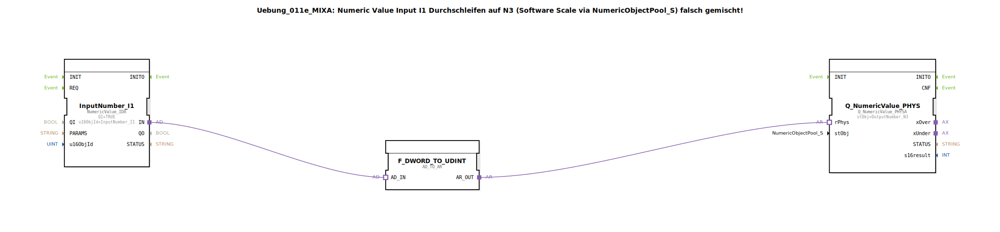

# Uebung_011e_MIXA: Numeric Value Input I1 Durchschleifen auf N3 (Software Scale via NumericObjectPool_S) falsch gemischt!

* * * * * * * * * *

## Einleitung

Diese Übung demonstriert das fehlerhafte Durchschleifen eines numerischen Eingabewerts von **InputNumber_I1** auf **OutputNumber_N3**. Der Wert wird ohne korrekte Skalierung (Software Scale) weitergegeben, da die verwendeten Namespaces `DefaultPool` und `DefaultPool_Numeric` inkompatibel sind. Ziel ist es, das Problembewusstsein für die korrekte Zuordnung von Quell- und Zielobjekten zu schärfen.

## Verwendete Funktionsbausteine (FBs)

### InputNumber_I1
- **Typ**: `isobus::UT::io::NumericValue::NumericValue_IDA`
- **Parameter**:
  - `QI` = `TRUE`
  - `u16ObjId` = `InputNumber_I1`
- **Funktionsweise**:  
  Liest den aktuellen Wert des numerischen Eingangs **I1** aus dem Pool `DefaultPool` und stellt ihn am Adapterausgang `IN` bereit.

### F_DWORD_TO_UDINT
- **Typ**: `adapter::conversion::unidirectional::AD_TO_AR`
- **Parameter**: keine
- **Funktionsweise**:  
  Konvertiert den am Adaptereingang `AD_IN` anliegenden DWORD-Wert in einen UDINT-Wert und gibt diesen am Adapterausgang `AR_OUT` aus.

### Q_NumericValue_PHYS
- **Typ**: `isobus::UT::Q::Q_NumericValue_PHYSA`
- **Parameter**:
  - `stObj` = `OutputNumber_N3`
- **Funktionsweise**:  
  Nimmt den konvertierten Wert über den Adaptereingang `rPhys` entgegen und schreibt ihn auf den numerischen Ausgang **N3** des Pools `DefaultPool_Numeric`.

## Programmablauf und Verbindungen

Das SubApp-Netzwerk verbindet die drei FB in einer Kette:

1. **InputNumber_I1** → liefert den aktuellen Wert von I1 als DWORD an seinem Adapterausgang `IN`.
2. **F_DWORD_TO_UDINT** → empfängt den DWORD-Wert am `AD_IN`, konvertiert ihn in einen UDINT und gibt diesen an `AR_OUT`.
3. **Q_NumericValue_PHYS** → erhält den UDINT-Wert an `rPhys` und schreibt ihn auf das Ausgangsobjekt `OutputNumber_N3`.

**Hinweis**: Die Namespaces der beiden Objekte sind inkompatibel:  
- `InputNumber_I1` stammt aus `Uebungen::const::UT::DefaultPool`.  
- `OutputNumber_N3` stammt aus `Uebungen::const::UT::DefaultPool_Numeric`.  

Daher wird der Wert zwar technisch weitergeleitet, aber die Skalierung bzw. Objektverknüpfung (Software Scale) ist nicht korrekt eingerichtet – die Übung dient als Negativbeispiel.

## Zusammenfassung

Die Übung zeigt eine bewusst falsch gemischte Konfiguration, bei der ein Eingangswert ohne Anpassung der Skalierung auf einen Ausgang eines anderen Namespace durchgeschleift wird. Der erwartete Effekt: Der Wert wird angezeigt (z. B. 10.00), aber die zugrunde liegende Objektzuordnung ist inkonsistent. Dies verdeutlicht die Notwendigkeit, Quell- und Zielobjekte aus demselben Pool zu verwenden oder eine explizite Skalierung vorzunehmen.