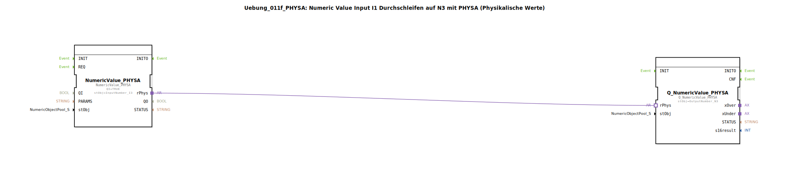

# Uebung_011f_PHYSA: Numeric Value Input I1 Durchschleifen auf N3 mit PHYSA (Physikalische Werte)

* * * * * * * * * *

## Einleitung

Diese Übung demonstriert das direkte Durchschleifen eines physikalischen Werts (PHYSA) ohne Konvertierung. Ein eingehender numerischer Wert von der Schnittstelle `InputNumber_I3` wird unverändert an die Ausgangsschnittstelle `OutputNumber_N3` weitergegeben. Die Übung veranschaulicht den Umgang mit physikalischen Werten im ISO‑BUS‑Kontext und die einfache Verbindung von Ein‑ und Ausgabebausteinen.

## Verwendete Funktionsbausteine (FBs)

In der SubApp sind zwei vordefinierte Funktionsbausteine eingesetzt:

### NumericValue_PHYSA
- **Typ**: `isobus::UT::io::NumericValue::NumericValue_PHYSA`
- **Parameter**:
  - `QI` = `TRUE` (Freigabe des Bausteins)
  - `stObj` = `InputNumber_I3` (Referenz auf die Eingabestelle)
- **Adapterausgang**: `rPhys` (physikalischer Wert)

Dieser Baustein liest den physikalischen Wert von der Eingabeadresse `InputNumber_I3`. Er ist so konfiguriert, dass der Wert direkt (ohne Umrechnung) am Adapterausgang `rPhys` bereitgestellt wird.

### Q_NumericValue_PHYSA
- **Typ**: `isobus::UT::Q::Q_NumericValue_PHYSA`
- **Parameter**:
  - `stObj` = `OutputNumber_N3` (Referenz auf die Ausgabestelle)
- **Adaptereingang**: `rPhys` (physikalischer Wert)

Dieser Baustein empfängt über seinen Adaptereingang `rPhys` den physikalischen Wert und schreibt ihn unverändert auf die Ausgabeadresse `OutputNumber_N3`.

Beide Bausteine werden aus den importierten Bibliotheken `Uebungen::const::UT::DefaultPool_Numeric::InputNumber_I3` und `Uebungen::const::UT::DefaultPool_Numeric::OutputNumber_N3` konfiguriert.

## Programmablauf und Verbindungen

Die Verbindung zwischen den beiden Bausteinen erfolgt über eine einzige **Adapterverbindung**:
- Quelle: `NumericValue_PHYSA.rPhys`
- Ziel: `Q_NumericValue_PHYSA.rPhys`

Der Datenfluss ist geradlinig: Sobald `NumericValue_PHYSA` aktiv ist (QI=TRUE), stellt es den aktuellen physikalischen Wert von `I3` bereit. Dieser Wert wird direkt an `Q_NumericValue_PHYSA` weitergeleitet, der ihn auf `N3` ausgibt. Es findet keine Umwandlung oder Verarbeitung statt – ein reines Durchschleifen.

**Einordnung:**  
Die Übung ist für Einsteiger geeignet, die die Grundlagen der ISO‑BUS‑Bausteinverwendung und des Signalflusses in 4diac‑IDE erlernen möchten. Sie zeigt die direkte Kopplung von Ein‑ und Ausgabebausteinen über physikalische Adapter.

## Zusammenfassung

Die Übung **Uebung_011f_PHYSA** realisiert eine einfache Durchschleifung eines physikalischen Werts ohne Konvertierung. Der Baustein `NumericValue_PHYSA` liest den Wert von `InputNumber_I3`, gibt ihn über den Adapterausgang `rPhys` an `Q_NumericValue_PHYSA` weiter, welcher den Wert auf `OutputNumber_N3` ausgibt. Die Übung ist ein grundlegendes Beispiel für die Nutzung von physikalischen Werten und Adapterverbindungen in 4diac.