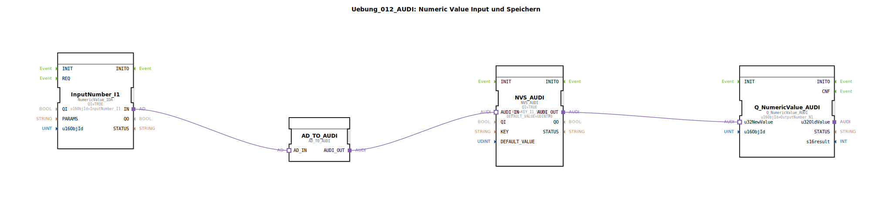

# Uebung_012_AUDI: Numeric Value Input und Speichern

* * * * * * * * * *
## Einleitung

Diese Übung demonstriert die Aufnahme eines numerischen Werts über den isobus I/O‑Stack, die Konvertierung in ein für die Audi‑Steuerung kompatibles Format und die persistente Speicherung des Werts im nichtflüchtigen Speicher (NVS). Der gespeicherte Wert wird anschließend über einen weiteren isobus‑Ausgabebaustein ausgegeben. Ziel ist das Verständnis des Datenflusses zwischen Eingabe, Konvertierung, Speicherung und Ausgabe.

## Verwendete Funktionsbausteine (FBs)

- **AD_TO_AUDI**  
  - **Typ**: `adapter::conversion::unidirectional::AD_TO_AUDI`  
  - **Parameter**: keine  
  - **Funktionsweise**: Wandelt das vom Eingabebaustein kommende Adapter‑Signal (isobus‑Seite) in ein adapter‑basiertes Signal für die Audi‑Komponenten um. Stellt die unidirektionale Verbindung zwischen dem isobus‑Adapter und dem NVS‑Adapter her.

- **InputNumber_I1**  
  - **Typ**: `isobus::UT::io::NumericValue::NumericValue_IDA`  
  - **Parameter**:  
    - `QI` = `TRUE`  
    - `u16ObjId` = `InputNumber_I1`  
  - **Funktionsweise**: Empfängt einen numerischen Wert aus dem isobus‑Netzwerk (definiert durch die Objekt‑ID `InputNumber_I1`) und gibt diesen über seinen Adapter‑Ausgang (`IN`) an den Konvertierungsbaustein weiter.

- **NVS_AUDI**  
  - **Typ**: `logiBUS::storage::esp32_nvs::NVS_AUDI`  
  - **Parameter**:  
    - `QI` = `TRUE`  
    - `KEY` = `KEY_I1_STORE`  
    - `DEFAULT_VALUE` = `UDINT#0`  
  - **Funktionsweise**: Speichert den an seinem Adapter‑Eingang anliegenden Wert persistent im nichtflüchtigen Speicher unter dem Schlüssel `KEY_I1_STORE`. Falls noch kein Wert gespeichert ist, wird der Default‑Wert `0` verwendet. Der gespeicherte Wert wird über den Adapter‑Ausgang bereitgestellt.

- **Q_NumericValue_AUDI**  
  - **Typ**: `isobus::UT::Q::Q_NumericValue_AUDI`  
  - **Parameter**:  
    - `u16ObjId` = `OutputNumber_N1`  
  - **Funktionsweise**: Nimmt den vom NVS‑Baustein gelieferten numerischen Wert entgegen und gibt ihn unter der isobus‑Objekt‑ID `OutputNumber_N1` im Netzwerk aus.

## Programmablauf und Verbindungen

Die Bausteine sind ausschließlich über Adapter‑Verbindungen verknüpft:

1. Der **InputNumber_I1**‑Baustein liest einen numerischen Wert aus dem isobus‑Netzwerk und sendet ihn über seinen Adapter‑Ausgang `IN` an den **AD_TO_AUDI**‑Baustein.
2. **AD_TO_AUDI** konvertiert das eingehende isobus‑Adapter‑Signal in ein Audi‑kompatibles Adapter‑Signal und leitet es über seinen Ausgang `AUDI_OUT` an den **NVS_AUDI**‑Baustein weiter.
3. **NVS_AUDI** speichert den empfangenen Wert persistent und stellt ihn gleichzeitig über seinen Adapter‑Ausgang `AUDI_OUT` bereit.
4. Der Ausgang von **NVS_AUDI** ist mit dem Daten‑Eingang (`u32NewValue`) des **Q_NumericValue_AUDI**‑Bausteins verbunden, der den Wert schließlich auf dem isobus‑Ausgang `OutputNumber_N1` veröffentlicht.

Die gesamte Verarbeitung erfolgt ereignisgesteuert: Sobald ein neuer Wert am Eingang ankommt, durchläuft er die Kette und wird sowohl gespeichert als auch direkt wieder ausgegeben.

## Zusammenfassung

In dieser Übung wird der gesamte Pfad eines numerischen Werts von der isobus‑Eingabe über eine Adapter‑Konvertierung und persistente Speicherung bis hin zur Netzwerkausgabe abgebildet. Die Verwendung der Adapter‑Schnittstellen ermöglicht eine lose Kopplung zwischen den Komponenten. Der Lernende erhält einen praktischen Einblick in die Datenverarbeitung mit isobus‑Bausteinen und die Integration eines nichtflüchtigen Speichers in eine 4diac‑Applikation.