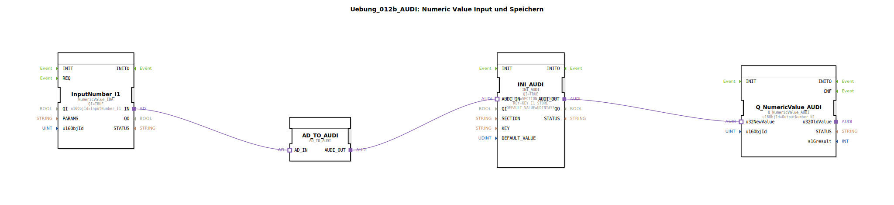

# Uebung_012b_AUDI: Numeric Value Input und Speichern

* * * * * * * * * *

## Einleitung

Diese Übung demonstriert die Aufnahme eines numerischen Werts über einen ISOBUS‑Eingang, dessen Umwandlung in ein speicherbares Format und die persistente Speicherung mittels eines INI‑basierten Speichermechanismus. Der gespeicherte Wert wird anschließend wieder ausgelesen und als ISOBUS‑Ausgabewert bereitgestellt. Die Funktionsbausteine kommunizieren über Adapter‑Schnittstellen (AUDI), die eine standardisierte Datenübergabe ermöglichen.

## Verwendete Funktionsbausteine (FBs)

Die Übung besteht aus einem Subapplikationsnetzwerk, das vier Funktionsbausteine sowie deren Adapterverbindungen enthält. Es werden keine weiteren Sub‑Bausteine (verschachtelte SubApplikationen) verwendet.

- **InputNumber_I1** (Typ: `isobus::UT::io::NumericValue::NumericValue_IDA`)  
  – Parameter: `QI = TRUE`, `u16ObjId = InputNumber_I1`  
  – Eingang: Adapter‑Schnittstelle `IN`  
  – Funktion: Liest einen numerischen Wert von einem ISOBUS‑Eingang (Object‑ID `InputNumber_I1`). Der ausgegebene Wert wird über den Adapter‑Ausgang `AD_IN` an die nächste Stufe weitergegeben.

- **AD_TO_AUDI** (Typ: `adapter::conversion::unidirectional::AD_TO_AUDI`)  
  – Funktion: Wandelt das Datenformat des vorherigen Adapters (`AD`‑Schnittstelle) in das AUDI‑Format um. Dadurch wird die Kompatibilität zwischen den unterschiedlichen Adaptertypen hergestellt.

- **INI_AUDI** (Typ: `eclipse4diac::storage::INI_AUDI`)  
  – Parameter: `QI = TRUE`, `SECTION = SECTION_I1_STORE`, `KEY = KEY_I1_STORE`, `DEFAULT_VALUE = UDINT#55`  
  – Eingang: Adapter‑Schnittstelle `AUDI_IN`  
  – Funktion: Schreibt den übergebenen numerischen Wert in einen INI‑Speicher (Abschnitt `SECTION_I1_STORE`, Schlüssel `KEY_I1_STORE`). Wird kein gültiger Wert geliefert, wird der Defaultwert 55 verwendet. Der gespeicherte Wert wird über den Adapter‑Ausgang `AUDI_OUT` ausgegeben.

- **Q_NumericValue_AUDI** (Typ: `isobus::UT::Q::Q_NumericValue_AUDI`)  
  – Parameter: `u16ObjId = OutputNumber_N1`  
  – Eingang: Datenanschluss `u32NewValue` (verbunden mit dem Adapter‑Ausgang von `INI_AUDI`)  
  – Funktion: Setzt den übergebenen 32‑Bit‑Wert als neuen Ausgabewert für die ISOBUS‑Objekt‑ID `OutputNumber_N1`. Der Wert wird so auf dem ISOBUS‑Datenfeld ausgegeben.

### Compiler‑Importe

Die Übung importiert folgende Konstanten aus der Bibliothek `Uebungen::const::NVS::NVS_Keys` und `Uebungen::const::UT::DefaultPool`:
- `KEY_I1_STORE` – der Schlüssel für den INI‑Speicher
- `SECTION_I1_STORE` – die Abschnittskennung für den INI‑Speicher
- `InputNumber_I1` – die ISOBUS‑Objekt‑ID des Eingabewerts
- `OutputNumber_N1` – die ISOBUS‑Objekt‑ID des Ausgabewerts

## Programmablauf und Verbindungen

1. Der Baustein **InputNumber_I1** empfängt einen numerischen Wert von der ISOBUS‑Schnittstelle und gibt diesen über seinen Adapter‑Ausgang `IN` aus.
2. Dieser Adapter‑Ausgang ist verbunden mit dem Adapter‑Eingang `AD_IN` von **AD_TO_AUDI**. Dieser Baustein konvertiert das Datenformat und stellt den Wert an seinem Ausgang `AUDI_OUT` bereit.
3. Der Ausgang `AD_TO_AUDI.AUDI_OUT` ist verbunden mit dem Adapter‑Eingang `AUDI_IN` von **INI_AUDI**. Dieser speichert den Wert persistent in einem INI‑Abschnitt.
4. Der gespeicherte Wert wird vom Adapter‑Ausgang `INI_AUDI.AUDI_OUT` an den Datenanschluss `u32NewValue` von **Q_NumericValue_AUDI** übergeben.
5. **Q_NumericValue_AUDI** setzt daraufhin den ISOBUS‑Ausgabewert mit der Objekt‑ID `OutputNumber_N1` auf diesen Wert.

Die gesamte Datenkette ist unidirektional und arbeitet ohne explizite Ereignissteuerung – die Ausführung erfolgt zyklisch durch die Laufzeitumgebung.

**Lernziele:**
- Verständnis der Adapter‑basierte Datenübergabe zwischen unterschiedlichen Funktionsbausteinen.
- Kennenlernen des INI‑Speicher‑Bausteins (`INI_AUDI`) zur persistenten Speicherung von Werten.
- Anwendung von ISOBUS‑Ein‑/Ausgabe‑Bausteinen mit konfigurierbaren Objekt‑IDs.

**Vorkenntnisse:**  
Grundlagen der 4diac‑IDE, Erstellung von Subapplikationen, Umgang mit Adaptern.

**Hinweise zur Übung:**  
Die Konstanten `SECTION_I1_STORE` und `KEY_I1_STORE` müssen im Projekt als NVS‑Konstanten definiert sein. Der Defaultwert von 55 dient als Fallback, falls noch kein Wert gespeichert wurde.

## Zusammenfassung

Die Übung **Uebung_012b_AUDI** zeigt einen vollständigen Datenpfad von der ISOBUS‑Eingabe über eine Formatkonvertierung, persistente Speicherung in einer INI‑Struktur bis zur ISOBUS‑Ausgabe. Sie veranschaulicht den Einsatz von Adaptern zur Kopplung unterschiedlicher Bausteintypen und die Verwendung von Speicherbausteinen für dauerhafte Datenhaltung. Nach erfolgreicher Durchführung können die Teilnehmer selbstständig ähnliche Datenspeicher‑ und Weiterleitungsketten in eigenen Projekten umsetzen.