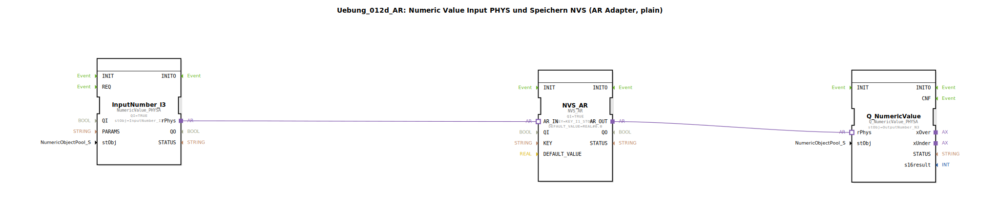

# Uebung_012d_AR: Numeric Value Input PHYS und Speichern NVS (AR Adapter, plain)

* * * * * * * * * *

## Einleitung

Diese Übung demonstriert die Erfassung eines numerischen Werts über einen physikalischen Eingang (PHYS), das Speichern des Werts im nichtflüchtigen Speicher (NVS) sowie die anschließende Ausgabe. Die Kommunikation zwischen den Funktionsbausteinen erfolgt über einen AR-Adapter (Adapter-Interface), ohne Verwendung von Unterbausteinen.

## Verwendete Funktionsbausteine (FBs)

- **InputNumber_I3**  
  - **Typ**: `isobus::UT::io::NumericValue::NumericValue_PHYSA`  
  - **Parameter**:
    - `QI` = `TRUE` (Aktivierung des Bausteins)
    - `stObj` = `InputNumber_I3` (Referenz auf das physische Eingangsobjekt)
  - **Funktion**: Liest einen numerischen Wert von einer physischen Eingangsschnittstelle und stellt ihn über den Ausgangsadapter `rPhys` bereit.

- **NVS_AR**  
  - **Typ**: `logiBUS::storage::esp32_nvs::NVS_AR`  
  - **Parameter**:
    - `QI` = `TRUE` (Aktivierung)
    - `KEY` = `KEY_I1_STORE` (Speicher-Schlüssel im NVS)
    - `DEFAULT_VALUE` = `REAL#0.0` (Standardwert, falls noch kein Wert gespeichert ist)
  - **Funktion**: Speichert einen eingehenden Wert im nichtflüchtigen Speicher (NVS) und gibt den gespeicherten (oder standardmäßigen) Wert über den Ausgangsadapter `AR_OUT` weiter. Der Adaptereingang `AR_IN` nimmt Eingabedaten entgegen.

- **Q_NumericValue**  
  - **Typ**: `isobus::UT::Q::Q_NumericValue_PHYSA`  
  - **Parameter**:
    - `stObj` = `OutputNumber_N3` (Referenz auf das physische Ausgangsobjekt)
  - **Funktion**: Gibt einen empfangenen numerischen Wert über eine physische Ausgangsschnittstelle aus. Die Daten werden über den Adaptereingang `rPhys` bereitgestellt.

## Programmablauf und Verbindungen

Die Funktionsbausteine sind über Adapter-Schnittstellen verbunden:

1. **Eingabe**: Der Baustein `InputNumber_I3` liest den aktuellen Wert einer physischen numerischen Eingabe (z. B. Potentiometer oder Sensor) und stellt diesen am Ausgangsadapter `rPhys` bereit.
2. **Speicherung und Weitergabe**: Der Adapterausgang `InputNumber_I3.rPhys` ist mit dem Adaptereingang `NVS_AR.AR_IN` verbunden. Der Baustein `NVS_AR` speichert den empfangenen Wert unter dem Schlüssel `KEY_I1_STORE` im nichtflüchtigen Speicher und gibt den gespeicherten (oder falls nicht vorhanden den Standardwert) über den Ausgangsadapter `AR_OUT` aus.
3. **Ausgabe**: Der Adapterausgang `NVS_AR.AR_OUT` ist mit dem Adaptereingang `Q_NumericValue.rPhys` verbunden. Der Baustein `Q_NumericValue` gibt den erhaltenen Wert auf dem physischen Ausgang `OutputNumber_N3` aus (z. B. Anzeige oder analoges Signal).

**Lernziele der Übung:**
- Verwendung von AR-Adaptern zur Datenübertragung zwischen Funktionsbausteinen.
- Kombination von physischer Ein-/Ausgabe mit nichtflüchtiger Speicherung.
- Parametrierung von Speicherbausteinen (NVS) mit Schlüsseln und Standardwerten.

**Schwierigkeitsgrad:** Mittel  
**Vorkenntnisse:** Grundlegende Kenntnisse der 4diac-IDE, Verständnis von Funktionsbausteinen und Adaptern.

## Zusammenfassung

Die Übung `Uebung_012d_AR` realisiert eine einfache Pipeline: physikalischer Eingang → Speicherung im NVS → physikalischer Ausgang. Die Datenweitergabe erfolgt ausschließlich über AR-Adapter, sodass keine komplexen Verbindungen zwischen einzelnen Ein-/Ausgängen nötig sind. Der gespeicherte Wert bleibt auch nach einem Neustart erhalten. Die Übung vermittelt den Umgang mit NVS-Speicher und adapterbasierter Kommunikation in der 4diac-Entwicklungsumgebung.