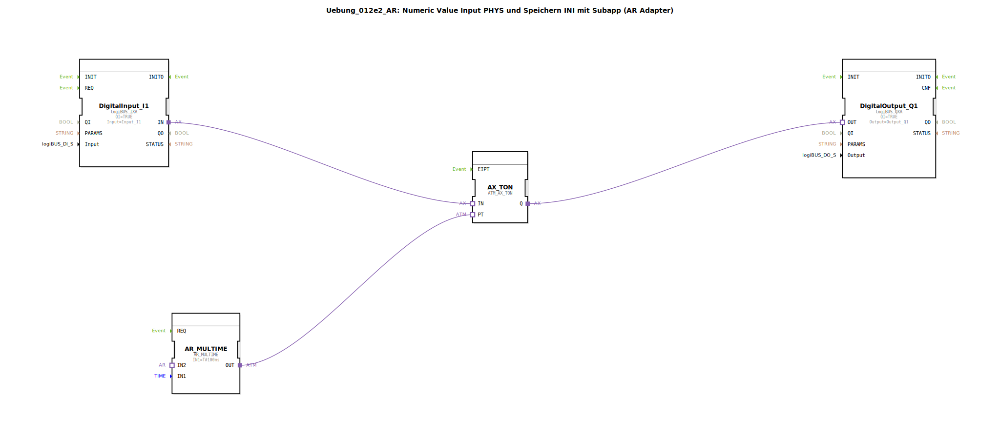

# Uebung_012e2_AR: Numeric Value Input PHYS und Speichern INI mit Subapp (AR Adapter)

* * * * * * * * * *
## Einleitung

Diese Übung demonstriert die Verwendung eines **AR-Adapters** zur Kombination eines logiBUS-Digital-Eingangs, einer parametrierbaren Zeitbasis und eines über einen Sub-App-Baustein konfigurierten Timerwerts, der aus einem NVS (Non-Volatile Storage) geladen wird. Ein digitales Eingangssignal startet einen Timer, dessen Ablaufzeit über einen gespeicherten numerischen Wert (INI) eingestellt wird. Der Timerausgang schaltet einen digitalen Ausgang. Die Besonderheit liegt in der AR-Adapter-Verknüpfung zwischen dem Speicherbaustein, der arithmetischen Einheit und dem Timer.

## Verwendete Funktionsbausteine (FBs)

### Sub-Bausteine: Uebung_012e_sub_AR
- **Typ**: `MyLib::sys::INI_IN_AND_STORE_AR`
- **Verwendete interne FBs**: (nicht im bereitgestellten XML enthalten; der Baustein wird als vordefinierter Sub-App-Typ importiert)
- Parameter:
  - `KEY` = `KEY_I1_STORE` (Konstante aus `Uebungen::const::NVS::NVS_Keys`)
  - `SECTION` = `SECTION_I1_STORE` (Konstante aus `Uebungen::const::NVS::NVS_Keys`)
  - `stObj` = `InputNumber_I3` (Konstante aus `Uebungen::const::UT::DefaultPool_Numeric`)
- **Funktionsweise**: Der Sub-Baustein lädt bei Initialisierung einen numerischen Wert (z. B. einen Timer-Sollwert) aus dem NVS unter dem angegebenen Schlüssel und Sektionsnamen. Der gespeicherte Wert wird am AR-Adapter-Ausgang `VALUEO` zur Verfügung gestellt. Er dient als variabler Operand für die nachfolgende arithmetische Verarbeitung.

### Weitere Funktionsbausteine

- **DigitalInput_I1**  
  - **Typ**: `logiBUS::io::DI::logiBUS_IXA`  
  - Parameter: `QI` = `TRUE`, `Input` = `Input_I1`  
  - Ereignisausgang/-eingang: AR-Adapter (`IN`)  
  - Datenausgang/-eingang: –  

- **AX_TON**  
  - **Typ**: `adapter::events::unidirectional::timers::ATM_AX_TON`  
  - Parameter: keine  
  - Ereignisausgang/-eingang: `IN` (Adapter), `Q` (Adapter)  
  - Datenausgang/-eingang: `PT` (Timer-Vorgabezeit) über AR-Adapter  

- **AR_MULTIME**  
  - **Typ**: `adapter::iec61131::arithmetic::AR_MULTIME`  
  - Parameter: `IN1` = `T#100ms` (fester Multiplikator)  
  - Datenausgang/-eingang: `IN2` (Multiplikand), `OUT` (Ergebnis) über AR-Adapter  

- **DigitalOutput_Q1**  
  - **Typ**: `logiBUS::io::DQ::logiBUS_QXA`  
  - Parameter: `QI` = `TRUE`, `Output` = `Output_Q1`  
  - Ereignisausgang/-eingang: AR-Adapter (`OUT`)  
  - Datenausgang/-eingang: –  

## Programmablauf und Verbindungen

1. **Digitaler Eingang**  
   Der Baustein `DigitalInput_I1` stellt das physikalische Signal `Input_I1` (z. B. Taster oder Sensor) als AR-Adapter-Signal `IN` zur Verfügung.

2. **Timer-Start**  
   Dieses Signal wird direkt mit dem `IN`-Adapter des Timers `AX_TON` verbunden.  
   - Bei einer steigenden Flanke (EIN) startet der Timer.

3. **Variable Timer-Zeit**  
   Der Sub-Baustein `Uebung_012e_sub_AR` liefert über seinen AR-Ausgang `VALUEO` den aus dem NVS geladenen numerischen Wert.  
   - Dieser Wert wird mit dem AR-Adapter an den `IN2`-Eingang des arithmetischen Bausteins `AR_MULTIME` übergeben.  
   - Der Baustein `AR_MULTIME` multipliziert den festen Wert `T#100ms` (IN1) mit dem variablen Wert (IN2) und gibt das Ergebnis (Time) an seinem `OUT`-Adapter aus.  
   - Der Ausgang `OUT` wird mit dem `PT`-Adapter des Timers `AX_TON` verbunden. Dadurch wird die Timer-Ablaufzeit dynamisch aus dem gespeicherten Wert berechnet.

4. **Digitaler Ausgang**  
   Der Timerausgang `Q` von `AX_TON` schaltet den `OUT`-Adapter des Ausgangsbausteins `DigitalOutput_Q1`. Somit wird der physikalische Ausgang `Output_Q1` aktiviert, solange der Timer läuft bzw. nach Ablauf der eingestellten Zeit.

**Erläuterung der Verbindungen im Netzwerk**:
- `DigitalInput_I1.IN` → `AX_TON.IN`
- `AX_TON.Q` → `DigitalOutput_Q1.OUT`
- `Uebung_012e_sub_AR.VALUEO` → `AR_MULTIME.IN2`
- `AR_MULTIME.OUT` → `AX_TON.PT`

## Zusammenfassung

**Lernziele**:
- Einbindung eines AR-Adapter-basierten Sub-App-Bausteins zur persistenten Speicherung von Konfigurationswerten (NVS).
- Arithmetische Verknüpfung von Konstanten und gespeicherten Werten über AR-Adapter.
- Realisierung einer einstellbaren Timer-Funktion mit einem digitalen Eingang und Ausgang.
- Verständnis der Adapter-basierten Kommunikation zwischen Funktionsbausteinen unterschiedlicher Bibliotheken.

**Schwierigkeitsgrad**: Mittel  
**Benötigte Vorkenntnisse**: Grundlegende Kenntnisse der 4diac-IDE, Umgang mit logiBUS-Bausteinen, AR-Adapter und NVS-Konstanten.  
**Start der Übung**: Importieren Sie das SubApp-Template `Uebung_012e2_AR` in ein neues 4diac-Projekt, stellen Sie sicher, dass die benötigten Bibliotheken (`logiBUS`, `MyLib`, `Uebungen::const`) im Build-Pfad liegen, und verbinden Sie die physikalischen E/A-Punkte entsprechend der Hardware.