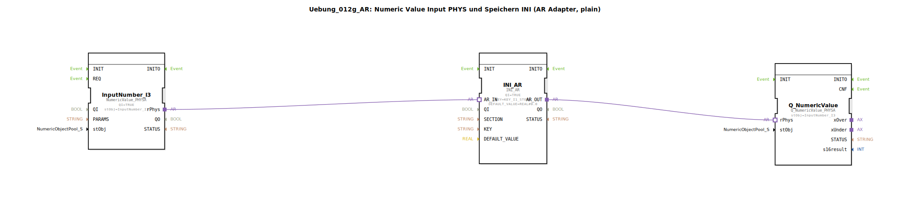

# Uebung_012g_AR: Numeric Value Input PHYS und Speichern INI (AR Adapter, plain)

* * * * * * * * * *

## Einleitung

In dieser Übung wird ein numerischer Wert (REAL) über einen physikalischen Eingang eingelesen und mittels des INI_AR-Adapters dauerhaft gespeichert. Der gespeicherte Wert kann anschließend über einen weiteren Ausgabebaustein visualisiert werden. Die Übung demonstriert den Einsatz des AR-Adapter-Interfaces (Adapter-Ressource) zur Kommunikation zwischen einem physikalischen Eingabebaustein und einem Speicherbaustein sowie einer numerischen Ausgabe.

## Verwendete Funktionsbausteine (FBs)

Es werden folgende Funktionsbausteine verwendet. Die SubApp enthält keine weiteren Sub-Bausteine.

---

### FB: `InputNumber_I3`
- **Typ**: `isobus::UT::io::NumericValue::NumericValue_PHYSA`
- **Parameter**:
  - `QI` = `TRUE` (Initialwert für die Qualität des Eingangs)
  - `stObj` = `InputNumber_I3` (Referenz auf das physikalische Eingangsobjekt)
- **Adapter**:
  - Ausgang-Adapter (`rPhys`) für die Übergabe des numerischen Werts
- **Funktionsweise**:  
  Der Baustein liest einen numerischen Wert (REAL) von der konfigurierten physikalischen Eingangsquelle ein. Der Wert wird über den `rPhys`-Adapterausgang an nachfolgende Bausteine weitergegeben.

---

### FB: `INI_AR`
- **Typ**: `eclipse4diac::storage::INI_AR`
- **Parameter**:
  - `QI` = `TRUE` (Aktivierung des Speichervorgangs)
  - `KEY` = `KEY_I1_STORE` (Speicherschlüssel, importiert aus `Uebungen::const::NVS::NVS_Keys`)
  - `DEFAULT_VALUE` = `REAL#0.0` (Standardwert, falls noch kein Wert gespeichert wurde)
- **Adapter**:
  - Eingang-Adapter (`AR_IN`) für den zu speichernden Wert
  - Ausgang-Adapter (`AR_OUT`) für den ausgelesenen gespeicherten Wert
- **Funktionsweise**:  
  Der Baustein speichert einen vom `AR_IN`-Adapter empfangenen Wert unter dem angegebenen Schlüssel im nichtflüchtigen Speicher (NVS). Beim Start oder nach dem Speichern wird der gespeicherte Wert am `AR_OUT`-Adapter bereitgestellt. Der `DEFAULT_VALUE` wird verwendet, wenn noch kein Wert hinterlegt ist.

---

### FB: `Q_NumericValue`
- **Typ**: `isobus::UT::Q::Q_NumericValue_PHYSA`
- **Parameter**:
  - `stObj` = `InputNumber_I3` (Referenz auf dasselbe physikalische Objekt wie beim Eingang)
- **Adapter**:
  - Eingang-Adapter (`rPhys`) für den anzuzeigenden Wert
- **Funktionsweise**:  
  Der Baustein gibt den über den `rPhys`-Adapter empfangenen numerischen Wert an die konfigurierte Ausgabe (z. B. eine Anzeige oder einen virtuellen Ausgang) weiter. Er dient zur Visualisierung oder Weiterverarbeitung des aktuellen oder gespeicherten Werts.

## Programmablauf und Verbindungen

Die Verbindung der Bausteine erfolgt ausschließlich über **Adapter**. Das Netzwerk besteht aus drei Bausteinen, die wie folgt miteinander verbunden sind:

1. **`InputNumber_I3.rPhys` → `INI_AR.AR_IN`**  
   Der vom Eingabebaustein gelesene physikalische Wert wird direkt an den INI_AR-Speicherbaustein übergeben.

2. **`INI_AR.AR_OUT` → `Q_NumericValue.rPhys`**  
   Der aus dem Speicher zurückgelesene Wert (entweder der neu gespeicherte oder der zuletzt gespeicherte) wird an den Ausgabebaustein weitergeleitet.

Damit wird eine einfache Pipeline realisiert:  
**Einlesen → Speichern → Ausgeben**

Die Funktionsweise ist ereignisgesteuert (im Hintergrund durch die Adapter). Die Parameter `QI` beider Bausteine sind dauerhaft auf `TRUE` gesetzt, sodass der Datenfluss kontinuierlich erfolgt.

**Lernziele:**
- Verständnis des AR-Adapter-Interfaces für die Kommunikation zwischen Bausteinen
- Einrichtung eines persistenten Speichers mit dem `INI_AR`-Baustein
- Zusammenspiel von physikalischem Eingang, Speicher und Ausgabe

**Schwierigkeitsgrad:** Mittel  
**Vorkenntnisse:** Grundlagen der 4diac-IDE, Umgang mit Funktionsbausteinen und Adaptern

## Zusammenfassung

Die Übung `Uebung_012g_AR` zeigt eine kompakte Realisierung eines numerischen Wertespeichers unter Verwendung des AR-Adapter-Konzepts. Der Wert wird von einem physikalischen Eingang gelesen, über den `INI_AR`-Baustein persistiert und anschließend über einen Ausgabebaustein sichtbar gemacht. Die Lösung besteht aus drei spezialisierten Funktionsbausteinen, die über Adapter verbunden sind und so eine saubere Trennung von Ein‑, Speicher‑ und Ausgabelogik ermöglichen.