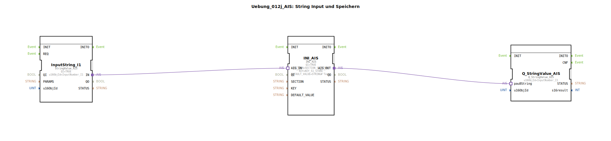

# Uebung_012j_AIS: String Input und Speichern

* * * * * * * * * *

## Einleitung

Diese Übung demonstriert das Einlesen eines String-Wertes über einen virtuellen Eingang, das Speichern in einem nichtflüchtigen Speicher (NVS) und die anschließende Ausgabe des gespeicherten Wertes. Sie zeigt den Umgang mit den Adapter-Schnittstellen der 4diac-IDE und die Nutzung vordefinierter Konstanten für Speicherbereiche.

Ziel ist es, einen Anfangswert (Default: „Test") im NVS zu speichern und diesen über einen Funktionsbaustein auszugeben, wobei der Wert bei jedem Neustart aus dem Speicher geladen wird.

## Verwendete Funktionsbausteine (FBs)

Die Übung besteht aus drei Funktionsbausteinen, die über Adapter verbunden sind:

### FB: InputString\_I1
- **Typ**: `isobus::UT::io::StringValue::StringValue_AIS`
- **Parameter**:
  - `QI` = `TRUE` (Baustein aktiv)
  - `u16ObjId` = `InputNumber\_I1` (Konstante zur Identifikation des Eingangsobjekts)
- **Ereignisausgang/-eingang**: Standard INIT/REQT (nicht näher konfiguriert)
- **Datenausgang/-eingang**: Ausgang `IN` (Adapterausgang, liefert den eingegebenen String)
- **Funktionsweise**: Dieser Baustein liest einen String-Wert von einer virtuellen Eingabestelle (z. B. HMI oder Simulation) und stellt ihn über den Adapter `IN` bereit. Der Wert wird durch die Objekt-ID `InputNumber_I1` identifiziert.

### FB: INI\_AIS
- **Typ**: `eclipse4diac::storage::INI_AIS`
- **Parameter**:
  - `QI` = `TRUE` (Baustein aktiv)
  - `SECTION` = `SECTION_S1_STORE` (Konstante für den Speicherabschnitt)
  - `KEY` = `KEY_S1_STORE` (Konstante für den Speicherschlüssel)
  - `DEFAULT_VALUE` = `STRING#'Test'` (Standardwert, falls noch kein Wert gespeichert ist)
- **Ereignisausgang/-eingang**: Standard INIT/REQT
- **Datenausgang/-eingang**:
  - `AIS_IN` (Adaptereingang, erwartet einen String)
  - `AIS_OUT` (Adapterausgang, gibt den gespeicherten oder geladenen String aus)
- **Funktionsweise**: Der Baustein fungiert als Speicherzugriff für nichtflüchtigen Speicher (NVS). Er speichert einen über `AIS_IN` erhaltenen String unter der angegebenen Sektion und dem Schlüssel. Wird kein neuer Wert zugeführt, liefert er den zuletzt gespeicherten Wert oder den `DEFAULT_VALUE` über `AIS_OUT`.

### FB: Q\_StringValue\_AIS
- **Typ**: `isobus::UT::Q::Q_StringValue_AIS`
- **Parameter**:
  - `u16ObjId` = `InputNumber_I1` (gleiche Objekt-ID wie Eingang)
- **Ereignisausgang/-eingang**: Standard INIT/REQT
- **Datenausgang/-eingang**:
  - `pau8String` (Adaptereingang, erwartet den anzuzeigenden String)
- **Funktionsweise**: Dieser Baustein gibt den über `pau8String` erhaltenen String an eine Ausgabestelle (z. B. Anzeige, übergeordnete Applikation) weiter. Die Ausgabe erfolgt anhand der Objekt-ID `InputNumber_I1`.

## Programmablauf und Verbindungen

Der Datenfluss innerhalb der SubApp erfolgt über Adapterverbindungen:

1. **Eingabe**: `InputString_I1` stellt den aktuellen String (vom HMI oder aus einer Simulation) an seinem Adapterausgang `IN` bereit.
2. **Speichern**: Der Adapterausgang `IN` wird mit dem Adaptereingang `AIS_IN` von `INI_AIS` verbunden. `INI_AIS` speichert diesen Wert im nichtflüchtigen Speicher (Sektion und Schlüssel gemäß den Konstanten).
3. **Ausgabe**: Der gespeicherte (oder geladene) Wert wird von `INI_AIS` über den Adapterausgang `AIS_OUT` bereitgestellt. Dieser ist mit dem Adaptereingang `pau8String` von `Q_StringValue_AIS` verbunden, der den Wert an die Ausgabestelle weitergibt.

Die SubApp ist so konzipiert, dass bei jedem Start automatisch der zuletzt gespeicherte Wert aus dem NVS geladen und ausgegeben wird (DEFAULT_VALUE dient als Initialwert). Eine externe Applikation kann den Eingangswert überschreiben, woraufhin der neue Wert gespeichert und sofort ausgegeben wird.

Hinweise:
- Die Konstanten `InputNumber_I1`, `SECTION_S1_STORE` und `KEY_S1_STORE` sind in übergeordneten Bibliotheken definiert und müssen vor der Verwendung importiert werden.
- Die Übung demonstriert ein typisches Muster für persistente Datenspeicherung in der Automatisierungstechnik.

## Zusammenfassung

Die Übung **Uebung_012j_AIS** zeigt die grundlegende Handhabung von String-Daten in Kombination mit nichtflüchtigem Speicher (NVS) in der 4diac-IDE. Durch die Verwendung von Adapterverbindungen wird ein datenbankähnlicher Zugriff auf gespeicherte Werte realisiert. Die drei Funktionsbausteine – Eingabe, Speicher und Ausgabe – bilden eine wiederverwendbare Komponente, die in verschiedenen Applikationen zur persistenten Speicherung von Benutzereingaben eingesetzt werden kann. Die vorgegebenen Konstanten sorgen für eine klare Trennung der Speicherbereiche und erleichtern die Wartbarkeit.