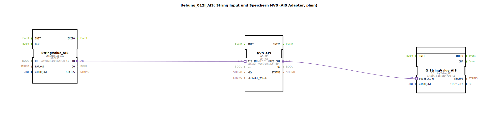

# Uebung_012l_AIS: String Input und Speichern NVS (AIS Adapter, plain)

* * * * * * * * * *
## Einleitung
Diese Übung demonstriert die Verwendung des AIS-Adapter-Protokolls zur Kommunikation zwischen einem String-Eingabebaustein und einem nichtflüchtigen Speicher (NVS). Der eingegebene String wird über einen AIS-Adapter an den NVS-Baustein übergeben und dort gespeichert. Ein Lesebaustein stellt den aktuell gespeicherten Wert wieder bereit. Die Übung dient als einfaches Beispiel für die Speicherung von Konfigurations- oder Zustandsdaten mittels des AIS-Modells in 4diac.

## Verwendete Funktionsbausteine (FBs)

### StringValue_AIS
- **Typ**: `isobus::UT::io::StringValue::StringValue_AIS`
- **Parameter**:
  - `QI` = `TRUE` (Eingang freigeschaltet)
  - `u16ObjId` = `InputString_S1` (Objekt-ID des Eingabestrings)
- **Funktionsweise**: Dieser Baustein stellt einen AIS-Adapter bereit, über den ein String eingegeben werden kann. Er ist die Quelle des zu speichernden Wertes.

### NVS_AIS
- **Typ**: `logiBUS::storage::esp32_nvs::NVS_AIS`
- **Parameter**:
  - `QI` = `TRUE` (Eingang freigeschaltet)
  - `KEY` = `KEY_S1_STORE` (Speicherschlüssel im NVS)
  - `DEFAULT_VALUE` = `STRING#'Test'` (Standardwert, falls der Schlüssel nicht existiert)
- **Funktionsweise**: Der Baustein realisiert einen nichtflüchtigen Speicher (NVS) mit AIS-Schnittstelle. Über den AIS_IN wird ein String empfangen und unter dem angegebenen Schlüssel gespeichert. Über den AIS_OUT wird der gespeicherte String (oder der Default-Wert) ausgegeben.

### Q_StringValue_AIS
- **Typ**: `isobus::UT::Q::Q_StringValue_AIS`
- **Parameter**:
  - `u16ObjId` = `InputString_S1` (Objekt-ID des Ausgabestrings)
- **Funktionsweise**: Dieser Baustein empfängt über seinen AIS-Adapter den aktuell gespeicherten String vom NVS und stellt ihn für die weitere Verarbeitung (z. B. Anzeige) zur Verfügung.

## Programmablauf und Verbindungen

Die drei Funktionsbausteine sind über AIS-Adapter verbunden:

1. **StringValue_AIS.IN** → **NVS_AIS.AIS_IN**: Der vom Benutzer eingegebene String wird direkt an den NVS-Baustein weitergeleitet.
2. **NVS_AIS.AIS_OUT** → **Q_StringValue_AIS.pau8String**: Der im NVS gespeicherte (bzw. der Default-) String wird an den Ausgabebaustein gesendet.

Der Ablauf ist zyklisch: Sobald ein neuer String eingegeben wird, aktualisiert der NVS den gespeicherten Wert und gibt diesen über den Ausgang weiter. Die Übung erfordert keine zusätzlichen Ereignisse, da die AIS-Adapter die Datenflüsse selbst steuern.

**Lernziele**:
- Verständnis des AIS-Adapterkonzepts für den Datenaustausch zwischen Funktionsbausteinen.
- Einfache persistente Speicherung von Strings im NVS.
- Konfiguration von Objekt-IDs und Speicherschlüsseln.

**Voraussetzungen**: Grundkenntnisse in 4diac und dem AIS-Adaptermodell.

## Zusammenfassung
Die Übung **Uebung_012l_AIS** zeigt eine minimalistische Kette: Stringeingabe → NVS-Speicherung → Ausgabe über AIS. Sie verdeutlicht, wie Konfigurationsdaten mit geringem Aufwand dauerhaft gespeichert und wieder ausgelesen werden können. Die Implementierung nutzt das AIS-Adapterprotokoll, ohne dass zusätzliche Ereignisverbindungen nötig sind.