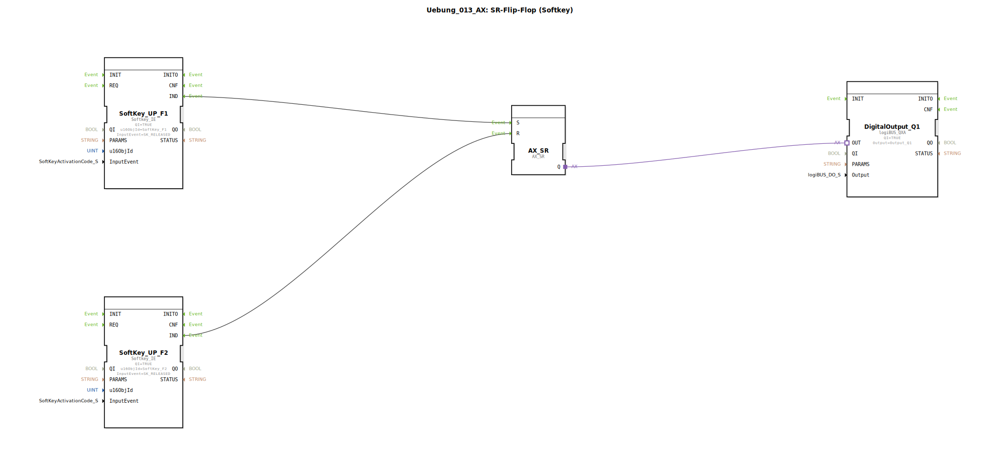

# Uebung_013_AX: SR-Flip-Flop (Softkey)

Dieser Artikel beschreibt die logiBUS®-Übung `Uebung_013_AX`.

## 🎧 Podcast

* [ISO 11783-6: Softkeys und das Virtual Terminal verstehen – Dein Schlüssel zur Landmaschinen-Mechatronik](https://podcasters.spotify.com/pod/show/isobus-vt-objects/episodes/ISO-11783-6-Softkeys-und-das-Virtual-Terminal-verstehen--Dein-Schlssel-zur-Landmaschinen-Mechatronik-e36a8b0)

----

## Ziel der Übung

Getrennte Ein/Aus Tasten auf dem Touchscreen.

-----

## Beschreibung

[cite_start]Die Subapplikation `Uebung_013_AX.SUB` verwendet zwei Softkeys, um ein `AX_SR` Flip-Flop zu steuern[cite: 1].

### Funktionsbausteine (FBs)

  * **`SoftKey_UP_F1`**: Event `SK_RELEASED` -> Set (`S`).
  * **`SoftKey_UP_F2`**: Event `SK_RELEASED` -> Reset (`R`).
  * **`AX_SR`**: Speicher.

-----

## Funktionsweise

*   Drücken (und Loslassen) von **F1** schaltet die Funktion ein.
*   Drücken (und Loslassen) von **F2** schaltet die Funktion aus.

Dies ist eine klare und sichere Bedienung, oft verwendet für "Start" und "Stopp" Symbole.