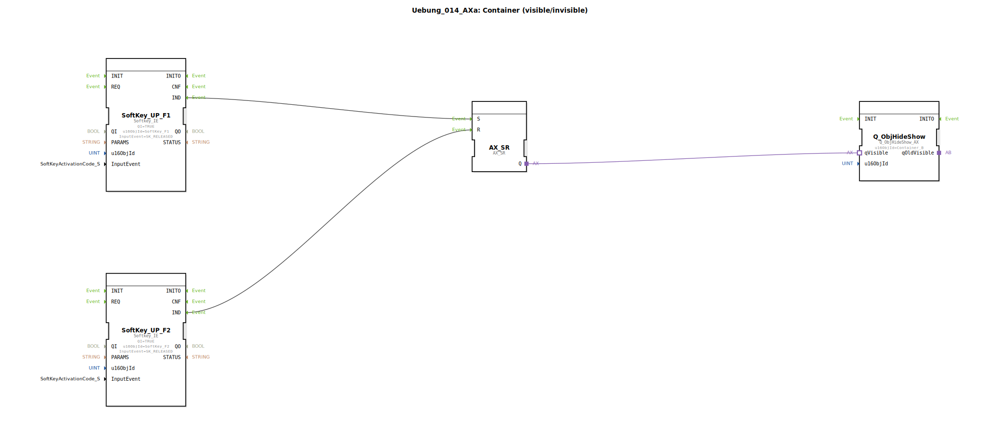

# Uebung_014_AXa: Container (visible/invisible)

* * * * * * * * * *
## Einleitung

Diese Übung demonstriert die Steuerung der Sichtbarkeit eines Containers (Objekts) durch zwei Softkeys. Mit SoftKey_F1 wird der Container eingeblendet, mit SoftKey_F2 ausgeblendet. Dabei wird ein Set-Reset-Flipflop (AX_SR) verwendet, um den Zustand zu speichern und an einen Hide/Show-Baustein weiterzugeben.

## Verwendete Funktionsbausteine (FBs)

### SoftKey_UP_F1 (Typ: isobus::UT::io::Softkey::Softkey_IE)
- **Parameter**:
  - `QI` = TRUE
  - `u16ObjId` = SoftKey_F1
  - `InputEvent` = SK_RELEASED
- **Ereignisausgang/-eingang**: Ereignisausgang `IND` (wird beim Loslassen von F1 ausgelöst)
- **Funktionsweise**: Dieser Baustein erfasst das Loslassen des Softkeys F1 und gibt ein Ereignis an seinem Ausgang `IND` aus.

### SoftKey_UP_F2 (Typ: isobus::UT::io::Softkey::Softkey_IE)
- **Parameter**:
  - `QI` = TRUE
  - `u16ObjId` = SoftKey_F2
  - `InputEvent` = SK_RELEASED
- **Ereignisausgang/-eingang**: Ereignisausgang `IND`
- **Funktionsweise**: Analog zu SoftKey_UP_F1, jedoch für Softkey F2.

### AX_SR (Typ: adapter::events::unidirectional::AX_SR)
- **Parameter**: Keine expliziten Parameter.
- **Adapteranschlüsse**:
  - Eingänge: `S` (Set), `R` (Reset)
  - Ausgang: `Q` (Zustand)
- **Funktionsweise**: Ein Set-Reset-Flipflop. Bei einem Ereignis auf `S` wird der Ausgang `Q` auf TRUE gesetzt, bei einem Ereignis auf `R` wird er zurückgesetzt (FALSE). Der Zustand bleibt erhalten, bis das nächste Ereignis eintrifft.

### Q_ObjHideShow (Typ: isobus::UT::Q::Q_ObjHideShow_AX)
- **Parameter**:
  - `u16ObjId` = Container_B
- **Adapteranschluss**: `qVisible` (Adapter-Eingang, erwartet einen booleschen Wert)
- **Funktionsweise**: Dieser Baustein steuert die Sichtbarkeit des Objekts mit der ID `Container_B`. Wenn am Adapter `qVisible` der Wert TRUE anliegt, wird das Objekt sichtbar geschaltet, bei FALSE unsichtbar.

## Programmablauf und Verbindungen

Die Ereignisausgänge der Softkey-Bausteine sind wie folgt verbunden:
- Das Ereignis `IND` von **SoftKey_UP_F1** ist mit dem Set-Eingang `S` von **AX_SR** verbunden.
- Das Ereignis `IND` von **SoftKey_UP_F2** ist mit dem Reset-Eingang `R` von **AX_SR** verbunden.

Der Zustandsausgang `Q` von **AX_SR** wird über den Adapter `qVisible` an den Baustein **Q_ObjHideShow** weitergeleitet.

**Ablauf**:
1. Wenn der Bediener Softkey F1 loslässt, wird ein Set-Ereignis an AX_SR gesendet. Dadurch wird der Ausgang `Q` auf TRUE gesetzt.
2. Der TRUE-Wert aktiviert den Baustein **Q_ObjHideShow**, wodurch der Container `Container_B` sichtbar wird.
3. Beim Loslassen von Softkey F2 wird ein Reset-Ereignis an AX_SR gesendet. `Q` wird auf FALSE gesetzt, der Container wird unsichtbar.

**Lernziele**:
- Steuerung der Sichtbarkeit eines Objekts über zwei Softkeys.
- Verwendung eines Set-Reset-Flipflops (AX_SR) zur Zustandspeicherung.
- Verbindung von Ereignis- und Datenadaptern in einer Subapplikation.

**Schwierigkeitsgrad**: Einfach  
**Benötigte Vorkenntnisse**: Grundlagen der Ereignisverarbeitung und Adapterverbindungen in 4diac.

## Zusammenfassung

Die Übung zeigt eine typische Anwendung zur Ein-/Ausblendung eines Containers mithilfe zweier Softkeys. Der Set-Reset-Baustein speichert den gewünschten Sichtbarkeitszustand, der über einen Adapter an den Hide/Show-Baustein übergeben wird. Dies ist ein einfaches Beispiel für die Zustandssteuerung in der industriellen Automatisierung mit 4diac.