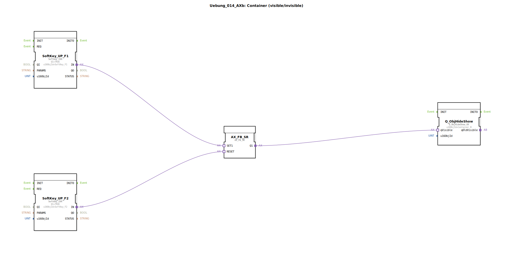

# Uebung_014_AXb: Container (visible/invisible)

* * * * * * * * * *
## Einleitung

Diese Übung demonstriert die Nutzung von Softkeys in Kombination mit einem SR-Flipflop, um ein grafisches Objekt (Container_B) ein- und auszublenden. Der Funktionsbaustein überwacht die Tastendrücke der Softkeys F1 (Setzen) und F2 (Rücksetzen) und steuert über ein SR-Glied die Sichtbarkeit des Containers. Die zugehörigen Konstanten *Container_B*, *SoftKey_F1* und *SoftKey_F2* sind aus einem globalen Pool importiert.

## Verwendete Funktionsbausteine (FBs)

### Sub-Bausteine: Uebung_014_AXb

Die Übung besteht aus einer Subapplikation, die folgende interne Funktionsbausteine enthält:

- **SoftKey_UP_F1**: `isobus::UT::io::Softkey::Softkey_IXA`
    - Parameter: `QI` = `TRUE`, `u16ObjId` = `SoftKey_F1`
    - Ereignisausgang: `IN` (bei Tastendruck)
    - Funktionsweise: Überwacht den Softkey F1 und gibt ein Ereignis am Ausgang `IN` aus, sobald die Taste gedrückt wird.

- **SoftKey_UP_F2**: `isobus::UT::io::Softkey::Softkey_IXA`
    - Parameter: `QI` = `TRUE`, `u16ObjId` = `SoftKey_F2`
    - Funktionsweise: Analog zu SoftKey_UP_F1, jedoch für die Taste F2.

- **AX_FB_SR**: `adapter::iec61131::bistableElements::AX_FB_SR`
    - Parameter: Keine
    - Eingänge: `SET1` (Ereignis), `RESET` (Ereignis)
    - Ausgänge: `Q1` (Wert)
    - Funktionsweise: Ein SR-Flipflop (bistabiles Element). Bei einem Ereignis auf `SET1` wird der Ausgang `Q1` auf TRUE gesetzt; bei `RESET` wird er auf FALSE zurückgesetzt.

- **Q_ObjHideShow**: `isobus::UT::Q::Q_ObjHideShow_AX`
    - Parameter: `u16ObjId` = `Container_B`
    - Eingang: `qVisible` (Wert)
    - Funktionsweise: Steuert die Sichtbarkeit des durch `u16ObjId` referenzierten Objekts (Container_B). Ist der Eingang `qVisible` = TRUE, wird der Container angezeigt; bei FALSE wird er ausgeblendet.

## Programmablauf und Verbindungen

Die Verbindungen innerhalb der Subapplikation sind wie folgt realisiert:

1. **SoftKey_UP_F1** – Drücken der Taste F1 → Ereignisausgang `IN` wird aktiv.
2. **SoftKey_UP_F2** – Drücken der Taste F2 → Ereignisausgang `IN` wird aktiv.
3. **AX_FB_SR** – Der Ereigniseingang `SET1` ist mit dem Ausgang von SoftKey_UP_F1 verbunden. Der Ereigniseingang `RESET` ist mit dem Ausgang von SoftKey_UP_F2 verbunden.
4. **Q_ObjHideShow** – Der Wert-Eingang `qVisible` ist mit dem Ausgang `Q1` des SR-Flipflops verbunden.

Ablauf:
- Ein Druck auf die Softkey-Taste **F1** setzt das SR-Flipflop, der Ausgang `Q1` wird = TRUE → der Container wird angezeigt.
- Ein Druck auf die Softkey-Taste **F2** setzt das Flipflop zurück, `Q1` wird = FALSE → der Container wird ausgeblendet.

Die Übung erfordert keine weiteren Datentypen oder Parameter. Der Benutzer muss lediglich die beiden Softkey-Tasten bedienen, um das Ein- und Ausblenden des Containers zu steuern.

## Zusammenfassung

In dieser Übung wird ein einfaches, aber praxisnahes Steuerungsmuster für die Visualisierung in einem ISOBUS-Terminal umgesetzt. Durch die Kombination von Softkey-Ereignissen, einem SR-Flipflop und einem Sichtbarkeitsbaustein wird das Verhalten eines „Ein/Aus“-Schalters für ein grafisches Objekt realisiert. Die Übung verdeutlicht das Zusammenspiel von Ereignis- und Datenflüssen in einer 4diac-Subapplikation und die Nutzung vordefinierter Bibliotheksbausteine für die ISOBUS-Kommunikation.