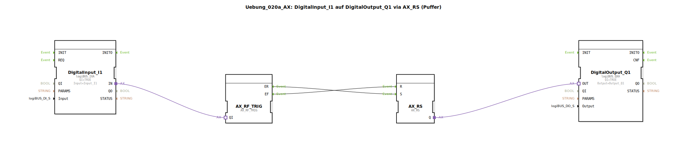

# Uebung_020a_AX: DigitalInput_I1 auf DigitalOutput_Q1 via AX_RS (Puffer)


[](https://notebooklm.google.com/notebook/041f4df4-b729-484d-b786-b6dcdf151961)

Dieser Artikel beschreibt die logiBUS®-Übung `Uebung_020a_AX`, bei der ein digitaler Eingang über eine RS-Speicherlogik auf einen digitalen Ausgang weitergeleitet wird.

----


## Ziel der Übung

Das Hauptziel dieser Übung ist es, die Kombination von Ereignis-Weichen (`AX_SWITCH`) und Speicherelementen (`AX_RS`) auf Adapter-Ebene zu demonstrieren. Während `Uebung_001_AX` eine direkte Verbindung nutzt, zeigt dieses Beispiel, wie Signale explizit durch Ereignisse ("Setzen" bei steigender Flanke, "Rücksetzen" bei fallender Flanke) verarbeitet werden können.

-----

## Beschreibung und Komponenten

[cite_start]Die Übung besteht aus einer Subapplikation (`Uebung_020a_AX.SUB`), die den Zustand eines Eingangs über eine Weiche in Set/Reset-Befehle für einen Speicher wandelt[cite: 1].

### Funktionsbausteine (FBs)




  * **`DigitalInput_I1`**: Typ `logiBUS_IXA`. Liest den physischen Eingang `Input_I1`.
  * **`AX_SWITCH`**: Eine Ereignis-Weiche. [cite_start]Leitet das eintreffende Adapter-Event je nach logischem Zustand des Eingangs `G` an den Ausgang `EO1` (TRUE) oder `EO0` (FALSE) weiter[cite: 1].
  * **`AX_RS`**: Ein RS-Flip-Flop mit Adapter-Schnittstelle. Es speichert den Zustand zwischen den Ereignissen.
  * **`DigitalOutput_Q1`**: Typ `logiBUS_QXA`. Setzt den physischen Ausgang `Output_Q1`.

-----

## Funktionsweise

Die Logik wird durch die Verknüpfung der Ereignis-Ausgänge der Weiche mit den Speicher-Eingängen realisiert:

```xml
<EventConnections>
    <Connection Source="AX_SWITCH.EO0" Destination="AX_RS.R"/>
    <Connection Source="AX_SWITCH.EO1" Destination="AX_RS.S"/>
</EventConnections>
<AdapterConnections>
    <Connection Source="DigitalInput_I1.IN" Destination="AX_SWITCH.G"/>
    <Connection Source="AX_RS.Q" Destination="DigitalOutput_Q1.OUT"/>
</AdapterConnections>
```

[cite_start][cite: 1]

Der Ablauf ist wie folgt:
1.  **Drücken von I1**: Der `IXA`-Baustein sendet ein Event und den Wert `TRUE`. Der `AX_SWITCH` leitet das Event an `EO1` -> `AX_RS` wird gesetzt (`S`) -> `Q1` geht an.
2.  **Loslassen von I1**: Der `IXA`-Baustein sendet ein Event und den Wert `FALSE`. Der `AX_SWITCH` leitet das Event an `EO0` -> `AX_RS` wird rückgesetzt (`R`) -> `Q1` geht aus.

Im Ergebnis verhält sich die Schaltung wie eine direkte Verbindung, nutzt aber intern eine ereignisbasierte Speicherlogik.

-----

## Anwendungsbeispiel

Dieses Muster ist die Basis für **Signalfilterung oder Entprellung**. Wenn man zwischen die Weiche und den Speicher weitere Logik (z.B. Timer) einfügt, kann man sehr präzise steuern, unter welchen Bedingungen ein Signal "einrasten" oder "abfallen" soll.