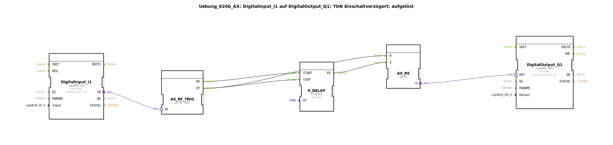

# Uebung_020b_AX: DigitalInput_I1 auf DigitalOutput_Q1; TON Einschaltverzögert; aufgelöst

Dieser Artikel beschreibt die logiBUS®-Übung `Uebung_020b_AX`. Hier wird eine Einschaltverzögerung (TON) nicht als fertiger Baustein verwendet, sondern aus diskreten Ereignis- und Speicherbausteinen aufgebaut.

----

## Ziel der Übung

Das Ziel dieser Übung ist es, das Verständnis für die zeitliche Steuerung von Ereignissen zu vertiefen. Anstatt den fertigen `AX_TON` Baustein (siehe `Uebung_020c_AX`) zu nutzen, wird hier demonstriert, wie ein `E_DELAY` Baustein in eine Logikschleife eingebunden werden kann, um eine identische Funktionalität zu erreichen.

-----

## Beschreibung und Komponenten

[cite_start]Die Subapplikation `Uebung_020b_AX.SUB` kombiniert eine Ereignis-Weiche, eine Zeitverzögerung und einen RS-Speicher[cite: 1].

### Funktionsbausteine (FBs)

  * **`DigitalInput_I1`**: Typ `logiBUS_IXA`. Signaleingang.
  * **`AX_SWITCH`**: [cite_start]Leitet das Ereignis bei steigender Flanke an `EO1` und bei fallender Flanke an `EO0` weiter[cite: 1].
  * **`E_DELAY`**: [cite_start]Verzögert ein am `START`-Eingang eintreffendes Ereignis um die Zeit `DT` (hier 2 Sekunden)[cite: 1].
  * **`AX_RS`**: Der Ergebnisspeicher.
  * **`DigitalOutput_Q1`**: Typ `logiBUS_QXA`. Signalausgang.

-----

## Funktionsweise

Die Logik arbeitet in drei Phasen:

1.  **Einschalten (Start der Verzögerung)**:
    Wird `I1` gedrückt, sendet die Weiche ein Event an `E_DELAY.START`. Die Zeit läuft.
2.  **Ablauf der Zeit (Durchschalten)**:
    Nach 2 Sekunden feuert `E_DELAY` an seinem Ausgang `EO`. Dieses Event setzt den Speicher `AX_RS.S` -> `Q1` geht an.
3.  **Ausschalten (Sofort-Stopp)**:
    Wird `I1` losgelassen, sendet die Weiche ein Event an `EO0`. Dieses Event stoppt sofort eine eventuell laufende Zeitmessung (`E_DELAY.STOP`) und setzt gleichzeitig den Speicher zurück (`AX_RS.R`) -> `Q1` geht sofort aus.

Im Ergebnis leuchtet die Lampe nur, wenn der Taster mindestens 2 Sekunden lang gehalten wird. Wird er vorher losgelassen, passiert nichts.

-----

## Anwendungsbeispiel

**Schutz gegen Fehlbedienung**: Ein Taster zum Öffnen eines schweren Tors oder zum Starten einer Maschine muss 2 Sekunden lang gehalten werden, um eine versehentliche Betätigung auszuschließen.