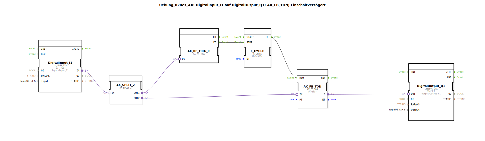

# Uebung_020c3_AX: DigitalInput_I1 auf DigitalOutput_Q1; AX_FB_TON; Einschaltverzögert

Dieser Artikel beschreibt die logiBUS®-Übung `Uebung_020c3_AX`. Hier wird der adapterbasierte IEC 61131-3 Timer-Baustein `AX_FB_TON` verwendet, der eine regelmäßige Triggerung (Takt) benötigt, um den internen Status (ET) zu aktualisieren.

----

## Ziel der Übung

Das Ziel ist es, eine Einschaltverzögerung mit einem klassischen SPS-Verhalten (inkl. ET-Ausgang) in einer ereignisbasierten Umgebung zu realisieren. Da `AX_FB_TON` ein zyklisches Verhalten für die Zeitberechnung erwartet, wird ein Taktgeber (`E_CYCLE`) eingesetzt.

-----

## Beschreibung und Komponenten

Die Subapplikation `Uebung_020c3_AX.SUB` nutzt einen `E_CYCLE` Baustein, um den Takt für den Timer zu generieren.

### Funktionsbausteine (FBs)

  * **`DigitalInput_I1`**: Liest den Eingangszustand über einen AX-Adapter ein.
  * **`AX_FB_TON`**: Der Einschaltverzögerungs-Timer mit Adapter-Schnittstellen. Er benötigt zyklische Ereignisse am `REQ`-Eingang.
  * **`E_CYCLE`**: Erzeugt alle 500ms ein Ereignis, solange der Eingang `I1` aktiv ist.
  * **`AX_SWITCH`**: Startet und stoppt den `E_CYCLE` basierend auf dem Eingangszustand.
  * **`DigitalOutput_Q1`**: Gibt das verzögerte Signal über einen AX-Adapter aus.

-----

## Funktionsweise

1.  **Start**: Sobald der Taster `I1` gedrückt wird, schaltet der `AX_SWITCH` den `E_CYCLE` ein.
2.  **Taktung**: Der `E_CYCLE` sendet alle 500ms ein Event an `AX_FB_TON.REQ`.
3.  **Verzögerung**: Nach Ablauf von 5 Sekunden (PT) wird der Ausgang `Q` des Timers aktiv.
4.  **Stopp**: Wird der Taster losgelassen, stoppt der `E_CYCLE` und der Timer wird zurückgesetzt.

-----

## Fazit

Dieses Beispiel verdeutlicht, dass Bausteine mit IEC 61131-3 Verhalten (wie die `AX_FB_*` Serie) eine kontinuierliche Ereignisquelle benötigen, um Zeitwerte wie `ET` korrekt zu verarbeiten.