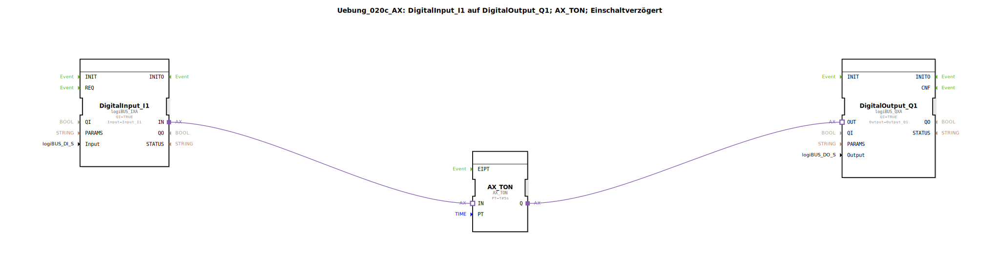

# Uebung_020c_AX: DigitalInput_I1 auf DigitalOutput_Q1; AX_TON; Einschaltverzögert

Dieser Artikel beschreibt die logiBUS®-Übung `Uebung_020c_AX`.

----

## Ziel der Übung

Kennenlernen des Timer-Bausteins `AX_TON`.

-----

## Beschreibung und Komponenten

[cite_start]Die Subapplikation `Uebung_020c_AX.SUB` verzögert das Einschaltsignal[cite: 1].

### Funktionsbausteine (FBs)

  * **`AX_TON`**: Timer On-Delay.
  * **Parameter `PT`**: Preset Time (hier 5 Sekunden).

-----

## Funktionsweise

1.  Eingang `I1` wird TRUE.
2.  `AX_TON` startet die Zeitmessung.
3.  Nach 5 Sekunden wird der Ausgang `Q` TRUE -> Lampe geht an.
4.  Wird `I1` vor Ablauf der 5s wieder FALSE, bricht der Timer ab und die Lampe bleibt aus.
5.  Beim Ausschalten von `I1` geht die Lampe sofort aus (keine Ausschaltverzögerung).

-----

## Anwendungsbeispiel

**Anlaufwarnung**: Bevor ein Förderband startet, ertönt für 5 Sekunden eine Hupe. Erst danach läuft der Motor an.