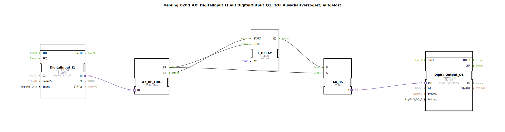

# Uebung_020d_AX: DigitalInput_I1 auf DigitalOutput_Q1; TOF Ausschaltverzögert; aufgelöst

Dieser Artikel beschreibt die logiBUS®-Übung `Uebung_020d_AX`. Hier wird eine Ausschaltverzögerung (TOF) aus diskreten Ereignis- und Speicherbausteinen aufgebaut.

----

## Ziel der Übung

Das Ziel dieser Übung ist die Analyse der Ausschaltverzögerung auf Logikebene. Im Gegensatz zur Einschaltverzögerung (`Uebung_020b_AX`) startet hier die Zeitmessung erst beim *Loslassen* des Tasters.

-----

## Beschreibung und Komponenten

[cite_start]Die Subapplikation `Uebung_020d_AX.SUB` nutzt eine Ereignis-Weiche, um den Speicher beim Drücken sofort zu setzen und beim Loslassen zeitverzögert zurückzusetzen[cite: 1].

### Funktionsbausteine (FBs)

  * **`DigitalInput_I1`**: Typ `logiBUS_IXA`. Signaleingang.
  * **`AX_SWITCH`**: [cite_start]Trennt steigende (`EO1`) und fallende (`EO0`) Flanken[cite: 1].
  * **`AX_RS`**: Der Ergebnisspeicher.
  * **`E_DELAY`**: [cite_start]Verzögert das Rücksetz-Ereignis um 2 Sekunden (`DT = T#2S`)[cite: 1].
  * **`DigitalOutput_Q1`**: Typ `logiBUS_QXA`. Signalausgang.

-----

## Funktionsweise

Die Logik arbeitet wie folgt:

1.  **Einschalten (Sofort)**:
    Wird `I1` gedrückt, sendet die Weiche ein Event an `EO1`. Dieses Event setzt sofort den Speicher `AX_RS.S` -> `Q1` geht an. Gleichzeitig wird eine eventuell noch laufende Verzögerung gestoppt (`E_DELAY.STOP`).
2.  **Loslassen (Start der Verzögerung)**:
    Wird `I1` losgelassen, sendet die Weiche ein Event an `EO0`. Dieses Event startet die Zeitmessung `E_DELAY.START`. Der Speicher bleibt vorerst auf TRUE.
3.  **Ausschalten (Nach Ablauf der Zeit)**:
    Nach 2 Sekunden feuert `E_DELAY.EO`. Dieses Event setzt den Speicher zurück (`AX_RS.R`) -> `Q1` geht aus.

Im Ergebnis leuchtet die Lampe sofort beim Drücken und bleibt nach dem Loslassen noch genau 2 Sekunden lang an.

-----

## Anwendungsbeispiel

**Nachlaufsteuerung**: Ein Treppenhauslicht oder ein Lüfter soll sofort anspringen, wenn der Schalter betätigt wird, aber nach dem Verlassen des Raumes noch für eine gewisse Zeit weiterlaufen.