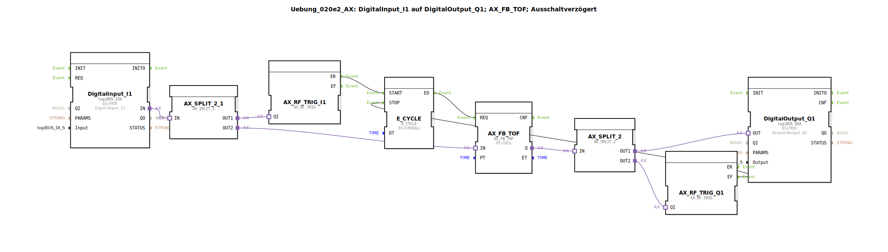

# Uebung_020e2_AX: DigitalInput_I1 auf DigitalOutput_Q1; AX_FB_TOF; Ausschaltverzögert

Dieser Artikel beschreibt die logiBUS®-Übung `Uebung_020e2_AX`. Hier wird der adapterbasierte IEC 61131-3 Timer-Baustein `AX_FB_TOF` verwendet, der eine regelmäßige Triggerung (Takt) benötigt.

----

## Ziel der Übung

Realisierung einer Ausschaltverzögerung, die auch während der Nachlaufzeit ihren Status (`ET`) aktualisiert.

-----

## Beschreibung und Komponenten

Die Subapplikation `Uebung_020e2_AX.SUB` nutzt einen `E_CYCLE` Baustein für die Taktung.

### Funktionsbausteine (FBs)

  * **`AX_FB_TOF`**: Der Ausschaltverzögerungs-Timer.
  * **`E_CYCLE`**: Liefert den Takt (500ms) für den Timer.
  * **`AX_SWITCH_I1`**: Startet den Takt bei Aktivierung des Eingangs.
  * **`AX_SWITCH_Q1`**: Stoppt den Takt erst dann, wenn auch der Ausgang des Timers wieder abgefallen ist (Nachlauf beendet).

-----

## Funktionsweise

1.  **Aktivierung**: Bei `I1 = TRUE` wird der Ausgang sofort aktiv und der Taktgeber startet.
2.  **Nachlauf**: Fällt `I1` ab, läuft der Timer weiter. Der `E_CYCLE` bleibt aktiv, da der Ausgang `Q` noch `TRUE` ist.
3.  **Abschluss**: Sobald die 5 Sekunden abgelaufen sind, fällt `Q` ab und der `E_CYCLE` wird gestoppt.

-----

## Fazit

Die Übung zeigt die komplexe Ansteuerung eines Ausschaltverzögerers, bei dem der Taktgeber über die gesamte Dauer (Einschaltzeit + Nachlaufzeit) aktiv bleiben muss.