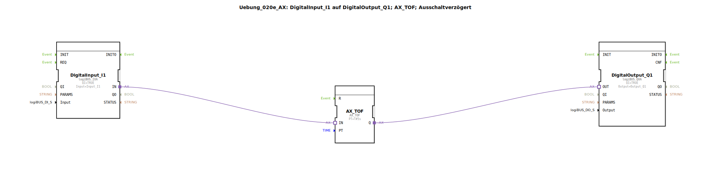

# Uebung_020e_AX: DigitalInput_I1 auf DigitalOutput_Q1; AX_TOF; Ausschaltverzögert

Dieser Artikel beschreibt die logiBUS®-Übung `Uebung_020e_AX`.

----

## Ziel der Übung

Kennenlernen des Timer-Bausteins `AX_TOF`.

-----

## Beschreibung und Komponenten

[cite_start]Die Subapplikation `Uebung_020e_AX.SUB` verzögert das Ausschaltsignal[cite: 1].

### Funktionsbausteine (FBs)

  * **`AX_TOF`**: Timer Off-Delay.
  * **Parameter `PT`**: Preset Time (hier 5 Sekunden).

-----

## Funktionsweise

1.  Eingang `I1` wird TRUE -> Lampe geht **sofort** an.
2.  Eingang `I1` wird FALSE -> Timer startet.
3.  Nach 5 Sekunden wird der Ausgang `Q` FALSE -> Lampe geht aus.

-----

## Anwendungsbeispiel

**Nachlauf**: Ein Lüfter im Bad läuft noch 5 Minuten nach, nachdem das Licht ausgeschaltet wurde.