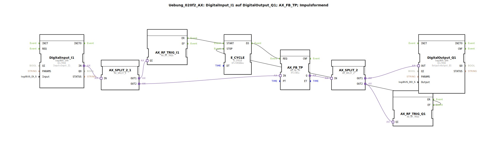

# Uebung_020f2_AX: DigitalInput_I1 auf DigitalOutput_Q1; AX_FB_TP; Impulsformend

Dieser Artikel beschreibt die logiBUS®-Übung `Uebung_020f2_AX`. Hier wird der adapterbasierte IEC 61131-3 Timer-Baustein `AX_FB_TP` verwendet, der eine regelmäßige Triggerung (Takt) benötigt.

----

## Ziel der Übung

Das Ziel ist es, die Brücke zwischen der klassischen SPS-Programmierung (zyklisch) und der IEC 61499 (ereignisbasiert) zu schlagen. Da ein `AX_FB_TP` intern die Zeit zählt, muss sein `REQ`-Eingang regelmäßig mit Ereignissen versorgt werden, solange der Timer läuft.

-----

## Beschreibung und Komponenten

Die Subapplikation `Uebung_020f2_AX.SUB` nutzt einen `E_CYCLE` Baustein, um den Takt für den Timer zu generieren.

### Funktionsbausteine (FBs)

  * **`AX_FB_TP`**: Der Impuls-Timer mit Adapter-Schnittstellen. Er reagiert auf die steigende Flanke am Eingang und hält den Ausgang für die Zeit `PT` auf TRUE.
  * **`E_CYCLE`**: Erzeugt alle 500ms ein Ereignis, um den Timer zu aktualisieren.
  * **`AX_SWITCH`**: Überwacht den Status, um den Taktgeber bei Bedarf zu starten oder zu stoppen.

-----

## Funktionsweise

1.  **Start**: Beim Drücken des Tasters wird der Impuls am `AX_FB_TP` ausgelöst und der `E_CYCLE` gestartet.
2.  **Taktung**: Der `E_CYCLE` sendet alle 500ms ein Event an `AX_FB_TP.REQ`. Bei jedem Event prüft der Timer, wie viel Zeit vergangen ist und aktualisiert seinen Status.
3.  **Impuls**: Solange der Impuls läuft, bleibt der Ausgang `Q` wahr.
4.  **Stopp**: Sobald die 5 Sekunden abgelaufen sind, stoppt der `E_CYCLE` über eine entsprechende Logik (`AX_SWITCH`).

Dieses Beispiel zeigt, dass klassische Bausteine zwar verwendet werden können, aber einen höheren Aufwand für die Ereignisverwaltung erfordern als spezialisierte Adapter-Bausteine (wie `AX_TP`).

-----

## Anwendungsbeispiel

**Integration von Legacy-Code**: Wenn bereits fertige Bausteine aus der "alten" SPS-Welt übernommen werden sollen, die auf zyklische Abarbeitung angewiesen sind, ist dieses Takt-Muster unerlässlich.