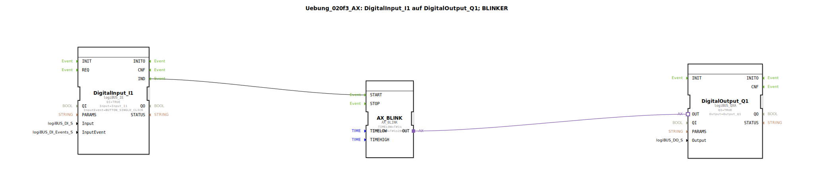

# Uebung_020f3_AX: DigitalInput_I1 auf DigitalOutput_Q1; BLINKER

Dieser Artikel beschreibt die logiBUS®-Übung `Uebung_020f3_AX`.

----

## Ziel der Übung

Verwendung des `AX_BLINK` Bausteins für asymmetrisches Blinken.

-----

## Beschreibung und Komponenten

[cite_start]Die Subapplikation `Uebung_020f3_AX.SUB` nutzt einen spezialisierten Blinker-Baustein[cite: 1].

### Funktionsbausteine (FBs)

  * **`AX_BLINK`**: Erzeugt ein Blinksignal.
  * **Parameter `TIMELOW`**: Zeit für "Aus" (1s).
  * **Parameter `TIMEHIGH`**: Zeit für "An" (1.2s).

-----

## Funktionsweise

Ein Event am Eingang `START` (hier vom Taster `I1` geliefert) startet den Blinker. Er läuft dann mit den parametrierten Zeiten. Der Baustein integriert im Grunde die Logik von zwei Timern und einem Flip-Flop.

-----

## Anwendungsbeispiel

**Fehlercode**: Eine LED blinkt in einem bestimmten Muster (kurz an, lang aus), um einen Fehlercode zu signalisieren.