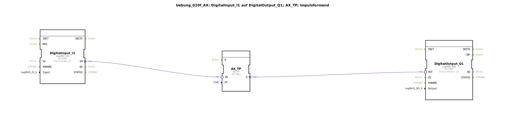

# Uebung_020f_AX: DigitalInput_I1 auf DigitalOutput_Q1; AX_TP; Impulsformend

Dieser Artikel beschreibt die logiBUS®-Übung `Uebung_020f_AX`. Hier wird ein Impuls-Timer (TP - Timer Pulse) verwendet, um eine definierte Einschaltdauer zu erzwingen.

----

## Ziel der Übung

Das Ziel dieser Übung ist die Anwendung des `AX_TP` Bausteins. Ein Impulsglied ist ideal, wenn eine Aktion für eine exakte Zeitspanne ausgeführt werden soll, unabhängig davon, wie lange der auslösende Taster gedrückt bleibt.

-----

## Beschreibung und Komponenten

[cite_start]Die Subapplikation `Uebung_020f_AX.SUB` nutzt einen Adapter-Timer vom Typ `AX_TP`[cite: 1].

### Funktionsbausteine (FBs)

  * **`DigitalInput_I1`**: Typ `logiBUS_IXA`. Der Auslöser.
  * **`AX_TP`**: [cite_start]Erzeugt bei einer steigenden Flanke am Eingang einen Impuls der Länge `PT` (hier 5 Sekunden) am Ausgang `Q`[cite: 1].
  * **`DigitalOutput_Q1`**: Typ `logiBUS_QXA`. Der Aktor.

-----

## Funktionsweise

1.  **Triggerung**: Sobald der Eingang `I1` den Zustand `TRUE` einnimmt, startet der Timer.
2.  **Aktivierung**: Der Ausgang `Q` wird sofort `TRUE` und die Lampe `Q1` leuchtet.
3.  **Zeitablauf**: Auch wenn der Nutzer den Taster sofort wieder loslässt (oder ihn 10 Sekunden lang gedrückt hält), bleibt die Lampe für exakt **5 Sekunden** an.
4.  **Abschluss**: Nach Ablauf der 5 Sekunden geht die Lampe automatisch aus. Ein neuer Impuls kann erst nach dem nächsten Flankenwechsel am Eingang ausgelöst werden.

-----

## Anwendungsbeispiel

**Schmierung oder Reinigung**: Eine Zentralschmierung an einer Maschine oder eine Reinigungsdüse soll nach einem Startsignal für genau 5 Sekunden aktiv sein, um die korrekte Menge an Medium abzugeben.