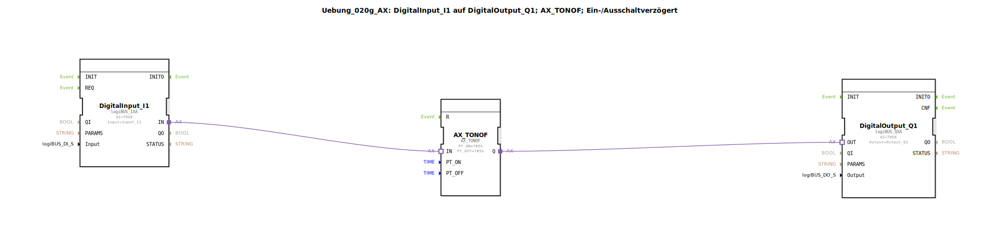

# Uebung_020g_AX: DigitalInput_I1 auf DigitalOutput_Q1; AX_TONOF; Ein-/Ausschaltverzögert

Dieser Artikel beschreibt die logiBUS®-Übung `Uebung_020g_AX`. Hier wird der kombinierte Verzögerungsbaustein `AX_TONOF` verwendet.

----

## Ziel der Übung

Das Ziel ist es, ein Signal in beide Richtungen zeitlich zu filtern. Kurze Impulse (sowohl positive als auch negative) werden ignoriert. Nur wenn ein Zustand länger als die definierte Zeit stabil anliegt, wird er an den Ausgang weitergegeben.

-----

## Beschreibung und Komponenten

[cite_start]Die Subapplikation `Uebung_020g_AX.SUB` nutzt den Baustein `AX_TONOF`[cite: 1].

### Funktionsbausteine (FBs)

  * **`DigitalInput_I1`**: Typ `logiBUS_IXA`.
  * **`AX_TONOF`**: [cite_start]Vereint Einschaltverzögerung (`PT_ON`) und Ausschaltverzögerung (`PT_OFF`) in einem Baustein. Hier sind beide Zeiten auf 5 Sekunden eingestellt[cite: 1].
  * **`DigitalOutput_Q1`**: Typ `logiBUS_QXA`.

-----

## Funktionsweise

1.  **Einschalten**: Wird `I1` gedrückt, passiert am Ausgang zunächst nichts. Erst nach **5 Sekunden** dauerhaften Drückens schaltet `Q1` ein.
2.  **Ausschalten**: Wird `I1` losgelassen, bleibt `Q1` zunächst an. Erst nach **5 Sekunden** im losgelassenen Zustand schaltet `Q1` aus.

Kurzes Antippen (< 5s) führt nicht zum Einschalten. Kurzes Loslassen (< 5s) führt nicht zum Ausschalten.

-----

## Anwendungsbeispiel

**Füllstandsüberwachung**: Ein Schwimmerschalter in einem Tank, in dem das Medium schwappt. Die Pumpe soll erst einschalten, wenn der Sensor 5 Sekunden lang "Leer" meldet, und erst ausschalten, wenn er 5 Sekunden lang "Voll" meldet. Dies verhindert ein nervöses Flattern der Pumpe bei Wellenbewegungen.