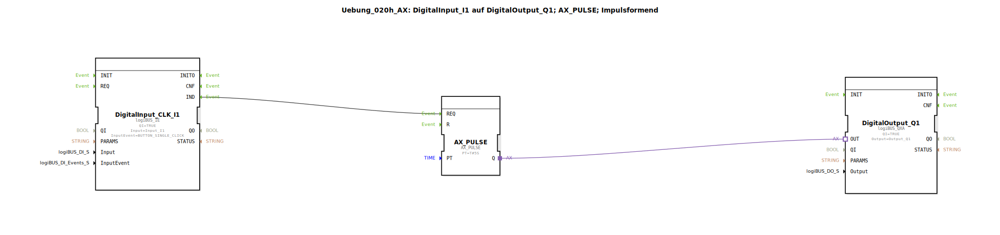

# Uebung_020h_AX: DigitalInput_I1 auf DigitalOutput_Q1; AX_PULSE; Impulsformend

Dieser Artikel beschreibt die logiBUS®-Übung `Uebung_020h_AX`. Hier wird der Baustein `AX_PULSE` verwendet, der im Gegensatz zum `AX_TP` rein ereignisbasiert arbeitet.

----

## Ziel der Übung

Das Ziel ist es, ein einzelnes, kurzes Ereignis (z.B. einen Mausklick oder Taster-Impuls) in eine länger anhaltende Aktion zu verwandeln. Der Fokus liegt hierbei auf der rein ereignisorientierten Schnittstelle des Bausteins.

-----

## Beschreibung und Komponenten

[cite_start]Die Subapplikation `Uebung_020h_AX.SUB` kombiniert einen Event-Eingang mit einem Adapter-Puls-Baustein[cite: 1].

### Funktionsbausteine (FBs)

  * **`DigitalInput_CLK_I1`**: Typ `logiBUS_IE`. Liefert ein Ereignis bei einem Einfachklick (`BUTTON_SINGLE_CLICK`).
  * **`AX_PULSE`**: [cite_start]Startet einen Timer bei Eintreffen eines Ereignisses am `REQ`-Eingang. Der Ausgang `Q` bleibt für die Zeit `PT` (5 Sekunden) auf TRUE[cite: 1].
  * **`DigitalOutput_Q1`**: Typ `logiBUS_QXA`.

-----

## Funktionsweise

1.  **Ereignis**: Der Nutzer klickt kurz auf den Taster `I1`.
2.  **Trigger**: Der Eingangsbaustein sendet ein `IND`-Event an den `REQ`-Eingang von `AX_PULSE`.
3.  **Aktion**: Der Timer startet sofort. Der Adapter-Ausgang `Q` wird `TRUE` und schaltet die Lampe `Q1` ein.
4.  **Autarkie**: Da der Baustein ereignisbasiert ist, muss der Eingang nicht gehalten werden. Er "merkt" sich den Startimpuls.
5.  **Ende**: Nach 5 Sekunden schaltet der Ausgang automatisch wieder auf `FALSE`.

-----

## Anwendungsbeispiel

**Türöffner**: Ein kurzer Tastendruck an der Gegensprechanlage löst einen elektrischen Türöffner für genau 5 Sekunden aus, damit der Besucher eintreten kann.