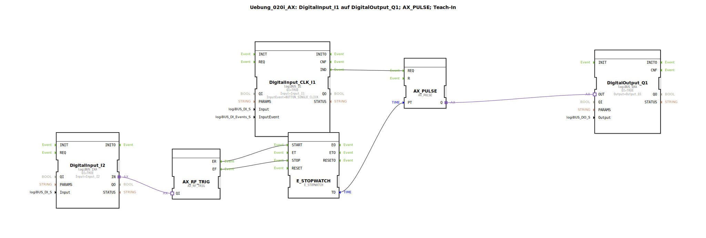

# Uebung_020i_AX: DigitalInput_I1 auf DigitalOutput_Q1; AX_PULSE; Teach-In

Dieser Artikel beschreibt die logiBUS®-Übung `Uebung_020i_AX`. Diese Übung kombiniert Zeitmessung und Zeitsteuerung zu einer lernfähigen Puls-Funktion.

----

## Ziel der Übung

Das Ziel ist die Implementierung eines Teach-In-Verfahrens. Anstatt die Zeit `PT` fest im Programm zu hinterlegen, kann der Bediener die gewünschte Dauer durch Halten eines Tasters vorgeben. Die Steuerung speichert diese Zeit und wendet sie bei zukünftigen Impulsen an.

-----

## Beschreibung und Komponenten

[cite_start]Die Subapplikation `Uebung_020i_AX.SUB` nutzt eine Stoppuhr, um die Zeitvorgabe für einen Puls-Baustein dynamisch zu ändern[cite: 1].

### Funktionsbausteine (FBs)

  * **`DigitalInput_I2` (Teach-Taste)**: Typ `logiBUS_IXA`. Misst, wie lange der Taster gedrückt wird.
  * **`AX_SWITCH`**: Wandelt das Drücken/Loslassen von `I2` in Start/Stopp-Signale für die Stoppuhr um.
  * **`E_STOPWATCH`**: [cite_start]Misst die Zeit zwischen `START` und `STOP` und gibt die Dauer am Ausgang `TD` aus[cite: 1].
  * **`AX_PULSE`**: Der Impuls-Baustein. Sein Zeitparameter `PT` ist mit dem gemessenen Wert `TD` der Stoppuhr verbunden.
  * **`DigitalInput_CLK_I1` (Start-Taste)**: Typ `logiBUS_IE`. Löst den Puls aus.
  * **`DigitalOutput_Q1`**: Typ `logiBUS_QXA`. Signalausgang.

-----

## Funktionsweise

Die Anwendung erfolgt in zwei Schritten:

1.  **Anlernen (Teach-In)**:
    Der Nutzer hält Taster `I2` für die gewünschte Dauer gedrückt (z.B. 3,5 Sekunden).
    *   Beim Drücken startet `E_STOPWATCH`.
    *   Beim Loslassen stoppt die Messung. Der Wert (3,5s) liegt nun am Eingang `PT` von `AX_PULSE` an.
2.  **Ausführen**:
    Der Nutzer klickt kurz auf Taster `I1`.
    *   `AX_PULSE` wird getriggert und schaltet die Lampe `Q1` für exakt die zuvor gelernten 3,5 Sekunden ein.

Jedes neue Anlernen über `I2` überschreibt die gespeicherte Zeit für den nächsten Puls.

-----

## Anwendungsbeispiel

**Dosiersteuerung**: Ein Landwirt möchte die Ausbringmenge eines Zusatzstoffs manuell kalibrieren. Er hält den Befüllknopf so lange, bis die gewünschte Testmenge erreicht ist. Die Steuerung merkt sich diese Zeit und kann den Dosiervorgang ab nun per einfachem Tastendruck exakt wiederholen.