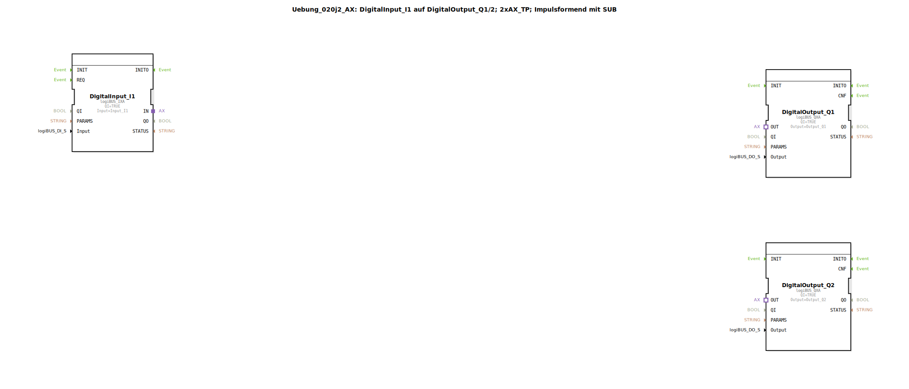

Hier ist die Dokumentation für die Übung `Uebung_020j2_AX`, basierend auf den bereitgestellten XML-Daten.

# Uebung_020j2_AX: DigitalInput_I1 auf DigitalOutput_Q1/2; 2xAX_TP; Impulsformend mit SUB

* * * * * * * * * *

## Einleitung
Diese Übung demonstriert die Verarbeitung von Signalen mittels Adapter-Verbindungen (AX) innerhalb einer IEC 61499 Anwendung. Ein digitales Eingangssignal (`DigitalInput_I1`) wird verwendet, um zwei separate digitale Ausgänge (`DigitalOutput_Q1` und `DigitalOutput_Q2`) anzusteuern. Die Besonderheit dieser Übung liegt in der Verwendung einer gekapselten Sub-Applikation (`Uebung_020j2_AX_sub`), die das Eingangssignal aufteilt und zwei unabhängige Impulsgeber (Pulse Timer) ansteuert.

## Verwendete Funktionsbausteine (FBs)

Im Hauptnetzwerk werden folgende Bausteine verwendet:

*   **DigitalInput_I1** (`logiBUS::io::DI::logiBUS_IXA`): Repräsentiert den physischen Eingang `Input_I1`.
*   **DigitalOutput_Q1** (`logiBUS::io::DQ::logiBUS_QXA`): Repräsentiert den physischen Ausgang `Output_Q1`.
*   **DigitalOutput_Q2** (`logiBUS::io::DQ::logiBUS_QXA`): Repräsentiert den physischen Ausgang `Output_Q2`.
*   **Uebung_020j2_AX_sub** (`Uebungen::Uebung_020j2_AX_sub`): Eine benutzerdefinierte Sub-Applikation, welche die Logik zur Impulsformung und Signalverteilung enthält.

### Sub-Bausteine: Uebung_020j2_AX_sub

Diese Sub-Applikation kapselt die Logik für das Splitten des Adapter-Signals und das Erzeugen der Zeitimpulse.

- **Typ**: SubAppType
- **Schnittstellen**:
    - **Eingangsvariablen**: `TQ1` (Zeitwert für Timer 1), `TQ2` (Zeitwert für Timer 2).
    - **Adapter-Eingang (Socket)**: `IN` (Typ: `AX`).
    - **Adapter-Ausgänge (Plugs)**: `Q1`, `Q2` (Typ: `AX`).

- **Verwendete interne FBs**:
    - **AX_SPLIT_2**: `adapter::events::unidirectional::AX_SPLIT_2`
        - **Funktion**: Teilt eine eingehende Adapter-Verbindung auf zwei ausgehende Adapter-Verbindungen auf (OUT1 und OUT2).
        - **Verbindung**: Der Eingang `IN` der Sub-App ist mit dem Eingang dieses Bausteins verbunden.

    - **AX_TP_Q1**: `adapter::events::unidirectional::timers::AX_TP`
        - **Parameter**: `PT` (Pulse Time) wird durch den Sub-App-Eingang `TQ1` gesetzt.
        - **Eingang**: Verbunden mit `OUT1` des `AX_SPLIT_2`.
        - **Ausgang**: Verbunden mit dem Adapter-Plug `Q1` der Sub-App.

    - **AX_TP_Q2**: `adapter::events::unidirectional::timers::AX_TP`
        - **Parameter**: `PT` (Pulse Time) wird durch den Sub-App-Eingang `TQ2` gesetzt.
        - **Eingang**: Verbunden mit `OUT2` des `AX_SPLIT_2`.
        - **Ausgang**: Verbunden mit dem Adapter-Plug `Q2` der Sub-App.

- **Funktionsweise**:
    Das eingehende Signal am Adapter `IN` wird durch den `AX_SPLIT_2` Baustein vervielfältigt. Beide Signalpfade durchlaufen anschließend jeweils einen eigenen Impuls-Timer (`AX_TP`). Diese Timer erzeugen einen Impuls definierter Länge (`TQ1` bzw. `TQ2`) auf der Adapter-Leitung, sobald ein Eingangssignal erkannt wird. Die resultierenden Signale werden an die Ausgänge `Q1` und `Q2` geleitet.

## Programmablauf und Verbindungen

Der Ablauf der Übung gestaltet sich wie folgt:

1.  **Signaleingang**:
    Das System liest den Zustand des digitalen Eingangs `Input_I1` über den Baustein `DigitalInput_I1`.

2.  **Verarbeitung in der Sub-Applikation**:
    *   Die Adapter-Verbindung des Eingangs wird an die Sub-Applikation `Uebung_020j2_AX_sub` weitergeleitet.
    *   Innerhalb der Sub-Applikation wird das Signal aufgeteilt.
    *   Es werden zwei unabhängige Timer gestartet, deren Zeitwerte über Parameter im Hauptnetzwerk definiert sind:
        *   **Pfad 1**: Zeitdauer `T#800ms` (Parameter `TQ1`).
        *   **Pfad 2**: Zeitdauer `T#1200ms` (Parameter `TQ2`).

3.  **Signalausgabe**:
    *   Der Ausgang `Q1` der Sub-Applikation (800ms Impuls) steuert den `DigitalOutput_Q1`.
    *   Der Ausgang `Q2` der Sub-Applikation (1200ms Impuls) steuert den `DigitalOutput_Q2`.

Dadurch wird erreicht, dass ein einzelnes Eingangssignal zwei Ausgänge aktiviert, die jedoch unterschiedlich lange aktiv bleiben (Impulsformung).

## Zusammenfassung

Die Übung `Uebung_020j2_AX` zeigt anschaulich die Verwendung von unidirektionalen Adapter-Verbindungen (`AX`) zur Signalverarbeitung. Sie demonstriert, wie Logik in Sub-Applikationen gekapselt werden kann, um komplexe Funktionen (hier: Signal-Splitting und parallele Timer-Steuerung) übersichtlich und wiederverwendbar zu gestalten. Lernziele sind der Umgang mit dem `AX_SPLIT` Baustein sowie die Parametrierung von Timer-Bausteinen (`AX_TP`) über Sub-Applikations-Schnittstellen.